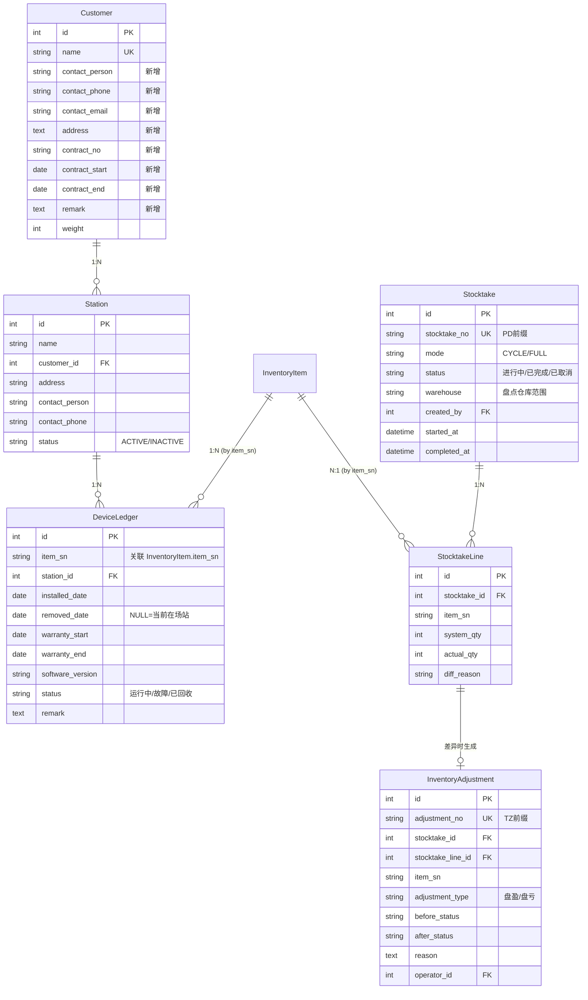

# IMS 二期开发方案

> **文档版本**：v1.0 | **更新日期**：2026-09-11 | **作者**：Trae
> **关联文档**：《IMS系统说明书》v1.1、《二次开发说明书》v1.0、《检测项目清单》v2.6

---

## 第1章 二期概述

### 1.1 项目背景

一期已完成 IMS 核心四条业务线的开发与测试：

- **主线A**：采购来料管理（到货→检验→入库）
- **主线B**：RMA返厂维修（退货→诊断→维修→质检→入库/报废→再出货）
- **主线C**：库存管理（一物一码、出入库、发货）
- **主线D**：生产管理（BOM、生产任务、齐套检查）

当前系统状态：后端 353/371 passed、前端 124/124 passed、专项 116/116 passed，一物一码追溯体系已跑通。

二期将在现有基础上扩展**场站级设备管理**能力，增加**移动端操作入口**，完善**数据看板**与**盘点多维度管控**。

### 1.2 二期目标

| 目标 | 说明 |
|------|------|
| 设备全生命周期可追溯 | 从"库房→场站→维修→再发"的完整链路 |
| 移动端操作 | 安卓App支持扫码查SN、退货登记、维修确认、审批待办 |
| 质保期自动判断 | 维修时自动判断在保/出保，减少人工核对 |
| 盘点闭环管理 | 循环盘点+全面盘点，差异自动生成调整记录 |
| 数据可视化 | 基础版看板：今日到货/待检验/待维修/库存概览 |

### 1.3 二期范围

#### P0（本期必做）

| # | 功能 | 说明 |
|---|------|------|
| 1 | 客户/场站档案 + 设备台账 | Customer扩展 + Station + DeviceLedger |
| 2 | 质保期管理 | 维修时自动判断在保/出保 |
| 3 | 盘点功能（库存盘点） | 循环盘点 + 全面盘点 + 差异调整 |
| 4 | 安卓App（Capacitor增强版） | 内网使用，含扫码、拍照、轮询提醒 |
| 5 | 数据看板（基础版） | 今日到货/待检验/待维修/库存概览 |

#### P1（二期第二批，本期不进入开发）

| 功能 | 说明 |
|------|------|
| 规则引擎 + 超时自动升级 | 减少人工跟进 |
| 产品全生命周期追溯 | 原材料→成品→场站完整链路 |
| 知识库 | 维修记录自动沉淀 |
| U9深度集成 | 如U9是必需对接系统 |

#### P2（后续迭代，本期不进入开发）

| 功能 | 说明 |
|------|------|
| 费用与成本管理 | 需先有准确的工时记录 |
| 委外维修管理 | 当前内部维修为主 |
| 批量操作增强 | 锦上添花 |
| AI故障趋势分析 | 需数据积累后才有价值 |

### 1.4 与一期的关系

| 维度 | 一期 | 二期 |
|------|------|------|
| 核心覆盖 | 库房内管理（采购→入库→出库→维修） | 场站级管理（出库→场站→运行→退回） |
| 设备视野 | SN在库房内的流转 | SN从库房到场站再到库房的全生命周期 |
| 操作终端 | Web浏览器 | Web + 安卓App |
| 盘点 | 仅库存查阅 | 循环盘点 + 全面盘点 + 差异调整 |
| 数据呈现 | 功能页面 | 数据看板 |

---

## 第2章 技术决策

### 2.1 安卓App方案：Capacitor

| 方案 | 优点 | 缺点 | 结论 |
|------|------|------|------|
| Capacitor打包 | 代码复用高，一套Vue出Web+App | 需适配原生功能 | ✅ **采纳** |
| WebView套壳 | 极低成本 | 扫码体验差 | ❌ |
| PWA | 零打包 | iOS支持弱、推送弱 | ❌ |

**技术栈**：
- 框架：Vue 3 + Vite + Element Plus（复用现有前端代码）
- 打包：Capacitor 6.x
- 原生插件：`@capacitor/camera`（拍照）、`@capacitor/barcode-scanner`（扫码增强，替代html5-qrcode）
- 网络：内网HTTP直连（不需HTTPS/SSL）

### 2.2 消息推送方案：轮询

| 方案 | 适用场景 | 结论 |
|------|---------|:---:|
| **轮询（30秒）** | 待办数量、审批提醒（分钟级） | ✅ **采纳** |
| WebSocket | 实时性要求高（秒级） | ❌ 过度设计 |

**理由**：业务场景是"审批待办、维修提醒"，不是秒级即时通讯。轮询实现简单，App后台不耗电，无需维护长连接。频率可配置（默认30秒）。

**实现方式**：
```
App端：setInterval(() => fetch('/api/v1/notifications/unread-count'), 30000)
后端：GET /api/v1/notifications/unread-count → { pending_approvals, pending_repairs, ... }
```

### 2.3 网络部署方案：仅内网

| 项目 | 方案 |
|------|------|
| 服务器 | 公司内网服务器（现有Docker部署） |
| 访问方式 | 连接公司WiFi，内网IP访问（如 `http://192.168.1.100:8080`） |
| 安卓App | 打包时写死内网地址 |
| 外网访问 | ❌ 不支持，也不需要 |
| VPN | 不需要 |

**关键要求**：
1. 服务器IP必须固定（静态IP或DHCP保留）
2. 手机WiFi与服务器在同一网段（或可路由互通）
3. App内网地址可通过配置文件修改（避免硬编码到所有请求中）

### 2.4 App分发方案

| 方式 | 说明 | 成本 |
|------|------|------|
| 企业微信群发APK | 把安装包发到群里，员工下载安装 | 零 |
| 内网下载页 | `http://192.168.1.100:8080/download` 放APK | 零 |

**版本更新**：初期手动重新下载安装，后续可加"启动检查版本号"提示更新。

---

## 第3章 数据模型设计

### 3.1 新增模型一览

| # | 模型 | 表名 | 说明 |
|---|------|------|------|
| 1 | Station | `station` | 场站档案 |
| 2 | DeviceLedger | `device_ledger` | 设备安装记录（台账） |
| 3 | Stocktake | `stocktake` | 盘点任务 |
| 4 | StocktakeLine | `stocktake_line` | 盘点明细行 |
| 5 | InventoryAdjustment | `inventory_adjustment` | 库存调整记录 |

### 3.2 修改现有模型

| 模型 | 表名 | 修改内容 |
|------|------|---------|
| Customer | `customer` | 新增 8 字段 |
| InventoryItemHistory | `inventory_item_history` | `event_type` 新增 `STOCKTAKE_ADJUST` |
| Enums | — | 新增 4 个枚举类 |

### 3.3 ER图



---

### 3.4 详细模型定义

#### 3.4.1 Station（场站档案）

| 字段 | 类型 | 必填 | 默认值 | 说明 |
|------|------|:---:|--------|------|
| `id` | INT | ✅ | 自增 | 主键 |
| `name` | VARCHAR(200) | ✅ | — | 场站名称，唯一 |
| `customer_id` | INT | ✅ | — | FK → `customer.id` |
| `address` | TEXT | ❌ | — | 场站地址 |
| `contact_person` | VARCHAR(50) | ❌ | — | 联系人 |
| `contact_phone` | VARCHAR(20) | ❌ | — | 联系电话 |
| `status` | VARCHAR(20) | ✅ | ACTIVE | ACTIVE / INACTIVE |
| `remark` | TEXT | ❌ | — | 备注 |
| `created_at` | DATETIME | ✅ | 继承 | 创建时间 |
| `updated_at` | DATETIME | ✅ | 继承 | 更新时间 |

#### 3.4.2 DeviceLedger（设备台账）

| 字段 | 类型 | 必填 | 默认值 | 说明 |
|------|------|:---:|--------|------|
| `id` | INT | ✅ | 自增 | 主键 |
| `item_sn` | VARCHAR(50) | ✅ | — | 设备SN，关联 `inventory_item.item_sn`，索引 |
| `station_id` | INT | ✅ | — | FK → `station.id` |
| `installed_date` | DATE | ✅ | — | 安装到场站日期 |
| `removed_date` | DATE | ❌ | — | 移除日期，NULL=当前在场站 |
| `warranty_start` | DATE | ❌ | — | 质保起始日期 |
| `warranty_end` | DATE | ❌ | — | 质保到期日期 |
| `software_version` | VARCHAR(50) | ❌ | — | 软件版本号 |
| `status` | VARCHAR(20) | ✅ | 运行中 | 运行中 / 故障 / 已回收 |
| `remark` | TEXT | ❌ | — | 备注 |
| `created_at` | DATETIME | ✅ | 继承 | 创建时间 |
| `updated_at` | DATETIME | ✅ | 继承 | 更新时间 |

**索引**：`item_sn`（普通索引，一对多）、`station_id` + `removed_date`（复合索引，查询"当前在场站的设备"）

**设计要点**：
- 一台设备可有多条记录（经历多个场站）
- `removed_date IS NULL` 表示当前在场站
- 每次设备出库到场站，创建新 DeviceLedger 记录，同时更新 `InventoryItem.current_location`
- 质保期跟随每次安装记录

#### 3.4.3 Stocktake（盘点任务）

| 字段 | 类型 | 必填 | 默认值 | 说明 |
|------|------|:---:|--------|------|
| `id` | INT | ✅ | 自增 | 主键 |
| `stocktake_no` | VARCHAR(30) | ✅ | — | 盘点单号 PD前缀，唯一 |
| `mode` | VARCHAR(10) | ✅ | CYCLE | CYCLE（循环）/ FULL（全面） |
| `status` | VARCHAR(20) | ✅ | IN_PROGRESS | IN_PROGRESS / COMPLETED / CANCELLED |
| `warehouse` | VARCHAR(30) | ✅ | — | 盘点仓库范围（ALL 或具体仓库类型） |
| `created_by` | INT | ✅ | — | FK → `sys_user.id` |
| `started_at` | DATETIME | ✅ | now() | 开始时间 |
| `completed_at` | DATETIME | ❌ | — | 完成时间 |
| `remark` | TEXT | ❌ | — | 备注 |
| `created_at` | DATETIME | ✅ | 继承 | 创建时间 |
| `updated_at` | DATETIME | ✅ | 继承 | 更新时间 |

#### 3.4.4 StocktakeLine（盘点明细行）

| 字段 | 类型 | 必填 | 默认值 | 说明 |
|------|------|:---:|--------|------|
| `id` | INT | ✅ | 自增 | 主键 |
| `stocktake_id` | INT | ✅ | — | FK → `stocktake.id` |
| `item_sn` | VARCHAR(50) | ✅ | — | 设备SN |
| `sku_id` | INT | ✅ | — | FK → `product_sku.id` |
| `system_qty` | INT | ✅ | 1 | 系统数量（固定为1，一物一码） |
| `actual_qty` | INT | ✅ | 0 | 实盘数量（0=未扫到/1=扫到） |
| `diff_qty` | INT | ✅ | 0 | 差异（actual_qty - system_qty） |
| `diff_reason` | VARCHAR(255) | ❌ | — | 差异原因 |
| `scanned_at` | DATETIME | ❌ | — | 扫码时间 |
| `scanned_by` | INT | ❌ | — | FK → `sys_user.id` |

#### 3.4.5 InventoryAdjustment（库存调整记录）

| 字段 | 类型 | 必填 | 默认值 | 说明 |
|------|------|:---:|--------|------|
| `id` | INT | ✅ | 自增 | 主键 |
| `adjustment_no` | VARCHAR(30) | ✅ | — | 调整单号 TZ前缀，唯一 |
| `stocktake_id` | INT | ✅ | — | FK → `stocktake.id` |
| `stocktake_line_id` | INT | ✅ | — | FK → `stocktake_line.id` |
| `item_sn` | VARCHAR(50) | ✅ | — | 设备SN |
| `adjustment_type` | VARCHAR(10) | ✅ | — | SURPLUS（盘盈）/ SHORTAGE（盘亏） |
| `before_status` | VARCHAR(30) | ✅ | — | 调整前库存状态 |
| `after_status` | VARCHAR(30) | ✅ | — | 调整后库存状态 |
| `reason` | TEXT | ✅ | — | 调整原因 |
| `operator_id` | INT | ✅ | — | FK → `sys_user.id` |
| `created_at` | DATETIME | ✅ | 继承 | 创建时间 |

### 3.5 Customer 模型扩展

| 新增字段 | 类型 | 必填 | 默认值 | 说明 |
|---------|------|:---:|--------|------|
| `contact_person` | VARCHAR(50) | ❌ | NULL | 联系人 |
| `contact_phone` | VARCHAR(20) | ❌ | NULL | 联系电话 |
| `contact_email` | VARCHAR(100) | ❌ | NULL | 邮箱 |
| `address` | TEXT | ❌ | NULL | 地址 |
| `contract_no` | VARCHAR(50) | ❌ | NULL | 合同编号 |
| `contract_start` | DATE | ❌ | NULL | 合同起始日期 |
| `contract_end` | DATE | ❌ | NULL | 合同到期日期 |
| `remark` | TEXT | ❌ | NULL | 备注 |

所有新增字段均为 `nullable`，不设 `server_default`，确保现有数据不受影响。

### 3.6 新增枚举

| 枚举类 | 值 | 说明 |
|--------|-----|------|
| `StocktakeMode` | `CYCLE` | 循环盘点（不锁库存） |
| | `FULL` | 全面盘点（锁定仓库） |
| `StocktakeStatus` | `IN_PROGRESS` | 进行中 |
| | `COMPLETED` | 已完成 |
| | `CANCELLED` | 已取消 |
| `AdjustmentType` | `SURPLUS` | 盘盈 |
| | `SHORTAGE` | 盘亏 |
| `DeviceLedgerStatus` | `RUNNING` | 运行中 |
| | `FAULT` | 故障 |
| | `RECOVERED` | 已回收 |

### 3.7 已有模型修改

#### InventoryItemHistory 事件类型扩展

在现有 `event_type` 注释中添加 `STOCKTAKE_ADJUST`：
```python
event_type: Mapped[str] = mapped_column(
    String(30), nullable=False,
    comment="INBOUND/OUTBOUND/STATUS_CHANGE/STOCKTAKE_ADJUST"
)
```

这不需要数据库迁移（已有字段的注释变更），但需要在 Alembic 中留下空的迁移记录以保持版本链完整。

#### InventoryItem.current_location 保持自由文本

`current_location` 不做结构化改造，保持 VARCHAR(50) 自由文本。设备出库时，同时更新 `current_location = Station.name` 和创建 `DeviceLedger` 记录。

---

### 3.8 Alembic 迁移方案

**迁移顺序**：

```
1. 创建 station 表
2. 创建 device_ledger 表
3. 创建 stocktake 表
4. 创建 stocktake_line 表
5. 创建 inventory_adjustment 表
6. 扩展 customer 表（8个新列）
7. 空白迁移（记录 InventoryItemHistory event_type 注释变更）
```

**迁移命令**：
```bash
cd backend
alembic revision --autogenerate -m "add_station_table"
alembic upgrade head
# ... 依次执行
```

**回滚验证**：
```bash
alembic downgrade -1  # 逐步回滚
alembic upgrade head  # 重新升回
```

---

## 第4章 后端API设计

### 4.1 Station API

| 方法 | 路径 | 说明 |
|------|------|------|
| `GET` | `/api/v1/stations` | 分页查询场站列表（支持按客户筛选） |
| `GET` | `/api/v1/stations/{id}` | 场站详情 |
| `POST` | `/api/v1/stations` | 创建场站 |
| `PUT` | `/api/v1/stations/{id}` | 更新场站 |
| `DELETE` | `/api/v1/stations/{id}` | 删除场站（仅限无关联设备时） |

**请求/响应示例**：

```json
// POST /api/v1/stations
{
  "name": "华东场站A",
  "customer_id": 1,
  "address": "上海市浦东新区XX路100号",
  "contact_person": "张三",
  "contact_phone": "13800138000",
  "remark": "主变电站"
}

// GET /api/v1/stations?customer_id=1&page=1&page_size=20
{
  "items": [
    {
      "id": 1,
      "name": "华东场站A",
      "customer_name": "国家电网",
      "address": "上海市浦东新区XX路100号",
      "status": "ACTIVE",
      "device_count": 15,
      "created_at": "2026-09-11T10:00:00"
    }
  ],
  "total": 1,
  "page": 1,
  "page_size": 20
}
```

### 4.2 DeviceLedger API

| 方法 | 路径 | 说明 |
|------|------|------|
| `GET` | `/api/v1/device-ledger` | 分页查询设备台账（支持按场站/SN/状态筛选） |
| `GET` | `/api/v1/device-ledger/{id}` | 台账详情 |
| `GET` | `/api/v1/device-ledger/by-sn/{sn}` | 根据 SN 查安装历史 |
| `GET` | `/api/v1/device-ledger/station/{station_id}` | 某场站当前在用设备 |
| `POST` | `/api/v1/device-ledger` | 创建设备安装记录（出库到场站时） |
| `PUT` | `/api/v1/device-ledger/{id}` | 更新台账信息（质保期、软件版本等） |
| `POST` | `/api/v1/device-ledger/{id}/remove` | 设备移除（设置 removed_date） |

### 4.3 Customer 扩展 API

现有 Customer CRUD API 不变，仅扩展 Pydantic Schema 的 Create/Update/Response 模型，新增字段自动生效。

### 4.4 质保期查询 API

| 方法 | 路径 | 说明 |
|------|------|------|
| `GET` | `/api/v1/device-ledger/warranty/{sn}` | 根据 SN 查质保状态 |

**响应示例**：
```json
{
  "item_sn": "SN20260911001",
  "in_warranty": true,
  "warranty_start": "2025-06-01",
  "warranty_end": "2028-06-01",
  "days_remaining": 628,
  "current_station": "华东场站A",
  "station_status": "运行中"
}
```

### 4.5 Stocktake API

| 方法 | 路径 | 说明 |
|------|------|------|
| `GET` | `/api/v1/stocktakes` | 分页查询盘点任务列表 |
| `GET` | `/api/v1/stocktakes/{id}` | 盘点任务详情（含明细行） |
| `POST` | `/api/v1/stocktakes` | 创建盘点任务 |
| `POST` | `/api/v1/stocktakes/{id}/scan` | 扫码记录（逐行更新 StocktakeLine） |
| `POST` | `/api/v1/stocktakes/{id}/complete` | 完成盘点（生成差异报告） |
| `POST` | `/api/v1/stocktakes/{id}/cancel` | 取消盘点 |

**创建盘点任务逻辑**：
```
全面盘点（FULL）：
  1. 检查 warehouse 范围内是否有进行中的出入库（operation_status IN INITIATED,PICKING,CHECKING）
  2. 如有 → 返回 409 "有N条出入库操作进行中，请等待完成"
  3. 如无 → 创建盘点任务，锁定仓库

循环盘点（CYCLE）：
  直接创建盘点任务，不锁库存
```

### 4.6 InventoryAdjustment API

| 方法 | 路径 | 说明 |
|------|------|------|
| `GET` | `/api/v1/inventory-adjustments` | 分页查询调整记录 |
| `POST` | `/api/v1/inventory-adjustments/{id}/confirm` | 确认调整（更新 InventoryItem 状态） |

**确认调整逻辑**：
```
1. 查询 StocktakeLine 差异行
2. 盘盈（actual_qty=1, system_qty=0）：创建 InventoryItem 或更新已报废 SN 为在库
3. 盘亏（actual_qty=0, system_qty=1）：更新 InventoryItem.status 为对应状态
4. 写入 InventoryItemHistory（event_type=STOCKTAKE_ADJUST）
5. 写入 AuditLog
```

### 4.7 数据看板 API

| 方法 | 路径 | 说明 |
|------|------|------|
| `GET` | `/api/v1/dashboard/overview` | 今日概览：到货/检验/维修/库存 |
| `GET` | `/api/v1/dashboard/trends` | 趋势：近30天出入库/维修趋势 |

**响应示例**：
```json
{
  "today_incoming": 12,
  "pending_inspection": 5,
  "pending_repair": 3,
  "in_stock_total": 1560,
  "device_in_station": 890,
  "warranty_expiring_soon": 8
}
```

---

## 第5章 前端页面设计

### 5.1 客户/场站档案管理

**路由**：`/customers` → 扩展现有客户管理页面，增加场站子页面 `/customers/:id/stations`

**页面结构**：
```
客户列表页（扩展现有 Partners.vue 的客户Tab）
├── 客户编辑表单（新增8个字段）
└── 场站列表（子Tab或嵌套路由）
    ├── 场站新增/编辑弹窗
    └── 场站详情（含设备台账入口）
```

### 5.2 设备台账

**路由**：`/device-ledger`

**页面结构**：
```
设备台账列表
├── 筛选：按场站、SN、状态、质保到期范围
├── 列表：SN | SKU名称 | 场站 | 安装日期 | 质保到期 | 状态
└── 详情弹窗：安装历史时间线、质保信息、软件版本
```

### 5.3 质保期查询

嵌入到 RMA 退货登记和设备台账详情中，无需独立页面。

- 在 RMA 退货录入 SN 时，自动查询并显示质保状态
- 在设备台账详情中显示质保倒计时

### 5.4 盘点任务

**路由**：`/stocktake`

**页面结构**：
```
盘点任务列表
├── 创建盘点（选择模式：循环/全面、仓库范围）
├── 盘点执行页
│   ├── 左侧：SN列表（系统数据）
│   ├── 右侧：扫码录入区（调用摄像头/扫码枪）
│   └── 底部：实时差异统计
├── 差异报告页（盘点完成后）
│   ├── 盘盈列表 / 盘亏列表
│   └── 确认调整按钮
└── 调整历史
```

### 5.5 数据看板

**路由**：`/dashboard` → 扩展现有 Dashboard.vue

**新增卡片**：
```
┌──────────────────────────────────────────────────┐
│ 今日概览                                          │
├──────────┬──────────┬──────────┬─────────────────┤
│ 今日到货 │ 待检验   │ 待维修   │ 在库总数          │
│   12     │    5     │    3     │    1560          │
├──────────┴──────────┴──────────┴─────────────────┤
│ 场站在用设备 │ 质保即将到期                          │
│    890      │      8                              │
└──────────────────────────────────────────────────┘
```

---

## 第6章 安卓App设计（Capacitor）

### 6.1 技术选型对比

| 维度 | Capacitor | PWA | WebView套壳 |
|------|:---:|:---:|:---:|
| 代码复用 | ✅ 高 | ✅ 高 | ✅ 高 |
| 原生扫码 | ✅ Camera插件 | ⚠️ 需HTTPS | ⚠️ html5-qrcode |
| 原生拍照 | ✅ Camera插件 | ✅ | ✅ |
| 打包难度 | ⚠️ 中 | ✅ 零 | ⚠️ 低 |
| 更新灵活性 | ❌ 需重装 | ✅ 即更新 | ❌ 需重装 |
| 后台能力 | ✅ 有限 | ❌ iOS不支持 | ❌ |
| **结论** | ✅ **采纳** | ❌ | ❌ |

### 6.2 环境搭建

```bash
# 1. 安装 Capacitor
cd frontend
npm install @capacitor/core @capacitor/cli
npm install @capacitor/android @capacitor/camera @capacitor/barcode-scanner

# 2. 初始化
npx cap init IMS com.company.ims --web-dir dist

# 3. 添加 Android 平台
npx cap add android

# 4. 配置内网地址
# capacitor.config.ts 中配置 server.url = "http://192.168.1.100:8080"
```

### 6.3 原生插件集成

| 功能 | 插件 | 说明 |
|------|------|------|
| 扫码 | `@capacitor/barcode-scanner` | 替代 html5-qrcode，调用原生相机扫码 |
| 拍照 | `@capacitor/camera` | 维修拍照取证 |
| 网络请求 | 复用 axios | 内网 HTTP，无需 HTTPS |
| 轮询提醒 | `setInterval` + axios | 30秒拉取待办数量 |
| 本地存储 | Capacitor Preferences | 存储登录Token |

### 6.4 内网地址配置

```typescript
// src/config/app.config.ts
export const APP_CONFIG = {
  // 内网地址，打包时修改此处
  API_BASE_URL: 'http://192.168.1.100:8080',
  // 轮询间隔（毫秒）
  POLLING_INTERVAL: 30000,
  // 版本号
  APP_VERSION: '2.0.0',
}
```

所有 API 请求统一使用 `APP_CONFIG.API_BASE_URL` 作为基础路径。

### 6.5 打包与分发

```bash
# 1. 构建前端
npm run build

# 2. 同步到 Capacitor
npx cap sync android

# 3. 打包 APK
cd android && ./gradlew assembleDebug

# 4. 输出路径
# android/app/build/outputs/apk/debug/app-debug.apk
```

**分发**：
- 将 APK 放到内网服务器 `static/download/ims.apk`
- 员工通过 `http://192.168.1.100:8080/download` 下载安装

### 6.6 版本更新机制

**初期**（P0）：手动更新 — 群发新版APK，员工覆盖安装

**后续**（P1）：启动检查 — App启动时调 `/api/v1/app/version`，对比版本号，提示下载

---

## 第7章 实施计划

### 7.1 第一阶段：数据模型（1-2天）

| # | 任务 | 产出 | 验收标准 |
|---|------|------|---------|
| 1 | 新建 Station 模型 | `models/station.py` | `alembic upgrade head` 成功 |
| 2 | 新建 DeviceLedger 模型 | `models/device_ledger.py` | 外键关联正确，一对多可查 |
| 3 | 新建 Stocktake + StocktakeLine 模型 | `models/stocktake.py` | 枚举完整，关联正确 |
| 4 | 新建 InventoryAdjustment 模型 | `models/inventory_adjustment.py` | 与 Stocktake 关联正确 |
| 5 | 扩展 Customer 模型 | 修改 `models/customer.py` | 现有数据不受影响 |
| 6 | 扩展 InventoryItemHistory 事件类型 | 修改 `models/inventory.py` | 注释更新 |
| 7 | 新增枚举 | 修改 `models/enums.py` | 枚举值完整 |
| 8 | Alembic 迁移 + 验证 | migration文件 | upgrade/downgrade 双向通过 |

### 7.2 第二阶段：后端API（3-4天）

| # | 任务 | 优先级 |
|---|------|:---:|
| 1 | Station CRUD API + Schema + Service | P0 |
| 2 | DeviceLedger CRUD + 查询 API | P0 |
| 3 | Customer 扩展字段适配（Schema更新） | P0 |
| 4 | 质保期查询接口 | P0 |
| 5 | Stocktake 创建/执行/完成 API | P0 |
| 6 | InventoryAdjustment 确认 API | P0 |
| 7 | 数据看板统计 API | P0 |
| 8 | 轮询通知接口 | P0 |

### 7.3 第三阶段：前端页面（3-4天）

| # | 任务 | 优先级 |
|---|------|:---:|
| 1 | 客户/场站档案管理页面 | P0 |
| 2 | 设备台账列表 + 详情页 | P0 |
| 3 | 质保期查询嵌入（RMA + 台账详情） | P0 |
| 4 | 盘点任务创建 + 执行页面 | P0 |
| 5 | 盘点差异处理页面 | P0 |
| 6 | 数据看板基础版 | P0 |

### 7.4 第四阶段：安卓App（3-4天，与第三阶段并行）

| # | 任务 | 优先级 |
|---|------|:---:|
| 1 | Capacitor 环境搭建 + 首次打包验证 | P0 |
| 2 | 移动端布局适配（Element Plus → 移动端） | P0 |
| 3 | 登录 + Token持久化 + 内网地址配置 | P0 |
| 4 | 扫码查SN | P0 |
| 5 | 退货登记（RMA 快速录入） | P0 |
| 6 | 维修确认 | P0 |
| 7 | 审批待办 + 轮询提醒 | P0 |
| 8 | 内网下载页（APK分发） | P0 |

### 7.5 里程碑与验收点

| 里程碑 | 时间 | 验收标准 |
|--------|------|---------|
| M1: 数据模型就绪 | D2 | 5张新表创建成功，迁移双向通过 |
| M2: 后端API就绪 | D6 | 所有P0 API通过契约测试 |
| M3: 前端页面就绪 | D10 | 所有P0页面可正常操作 |
| M4: App可安装使用 | D14 | APK可安装、登录、扫码 |
| M5: 联调通过 | D16 | 全流程走通，无阻塞Bug |

---

## 第8章 风险与应对

### 8.1 风险识别

| # | 风险 | 影响 | 概率 | 严重度 |
|---|------|------|:---:|:---:|
| R1 | Customer 迁移导致现有数据丢失 | 客户数据不可用 | 低 | 高 |
| R2 | DeviceLedger 与 InventoryItem SN 关联不一致 | 台账数据不准 | 中 | 高 |
| R3 | 全面盘点锁库存导致业务中断 | 出入库无法进行 | 低 | 中 |
| R4 | App兼容性问题（不同品牌安卓手机） | 部分员工无法使用 | 中 | 中 |
| R5 | 内网IP变化导致App无法连接 | App全部不可用 | 低 | 高 |

### 8.2 风险应对

| # | 应对措施 |
|---|---------|
| R1 | 所有新增列 nullable，不做 ALTER COLUMN。迁移前备份数据库。先在测试环境验证。 |
| R2 | 出库时事务中同时更新 current_location 和创建 DeviceLedger。提供数据校验脚本。 |
| R3 | 全面盘点前检查操作状态，有进行中的操作则拒绝创建。盘点按钮标注"将锁定仓库"。 |
| R4 | 提前确认员工手机型号。Capacitor 目标 Android 8.0+。主流品牌（华为/小米/OPPO/vivo）优先测试。 |
| R5 | 联系IT将服务器IP设为静态IP或DHCP保留。App中IP地址提取到配置文件，方便修改重打包。 |

---

## 第9章 附录

### 9.1 完整数据字典（引用）

二期新增表的数据字典将在开发完成后由 `generate_data_dict.py` 自动生成，追加到 `docs/附录/数据字典.md`。

### 9.2 二期API清单

| 模块 | 端点数量 | 说明 |
|------|:---:|------|
| Station | 5 | CRUD + 分页查询 |
| DeviceLedger | 7 | CRUD + 按SN/场站查询 + 移除 |
| Customer | 0（复用） | Schema扩展，API不变 |
| Stocktake | 6 | 创建/扫码/完成/取消/查询 |
| InventoryAdjustment | 2 | 查询 + 确认 |
| Dashboard | 2 | 概览 + 趋势 |
| Notifications | 1 | 未读数量 |
| **合计** | **23** | |

### 9.3 二期环境变量清单

| 变量 | 说明 | 默认值 |
|------|------|--------|
| `POLLING_INTERVAL` | 轮询间隔（秒） | 30 |
| `APP_VERSION` | App版本号 | 2.0.0 |
| `API_BASE_URL` | 内网API地址 | `http://192.168.1.100:8080` |

> 以上变量仅需在 App 配置文件中设置，无需添加到后端 `.env`。

---

> **文档结束** | 下一步：开发开始前需确认《二期检查规范》