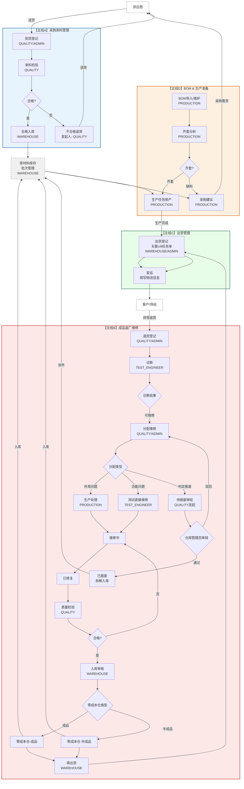

# 敦临 IMS 用户角色与业务流程设计

> 本文档定义系统的用户角色体系、人员配置、登录命名规范，以及完整的业务流程流转关系。
> 后续涉及权限、流程、人员的任何变更，均以此文档为基准进行更新。

---

## 第一章：用户角色设计

### 1.1 设计原则

1. **角色固定，人员可变**：四大主线角色（ADMIN / WAREHOUSE / QUALITY / PRODUCTION / TEST_ENGINEER / STAFF）是系统职责的基本单元，不随人员流动而改变。
2. **一人一账号一角色**：当前版本采用单角色模型，每个用户账号只绑定一个角色。如果一个人身兼多职，需创建多个账号分别登录。
3. **责任到人**：审计日志记录的是具体操作人（用户 ID + 昵称），而非角色名，确保每个操作可追溯。
4. **最小权限**：每个角色只拥有完成本职工作所需的最小权限集合。

### 1.2 人员名单与登录账号

| 序号 | 角色 | 真实姓名 | 登录名 | 昵称 | 初始密码 | 默认首页 | 说明 |
|:---:|------|---------|-------|------|---------|---------|------|
| 0 | ADMIN | 管理员 | `admin` | 管理员 | `12345678` | 系统管理 | 系统管理员账号，最大权限 |
| 1 | ADMIN | 左文峰 | `zwf` | 左文峰 | `12345678` | 系统管理 | 总经理/管理员，全权限 |
| 2 | PRODUCTION | 颜冬 | `yd` | 颜冬 | `12345678` | 主线D·BOM管理 | 生产，负责 BOM 与生产任务 |
| 3 | PRODUCTION | 乔森 | `qs` | 乔森 | `12345678` | 主线B·返厂维修 | 生产，负责外观维修 |
| 4 | QUALITY | 吕芳强 | `lfq` | 吕芳强 | `12345678` | 主线A·来料检验 | 质检人员，负责来料检 + RMA 质检 |
| 5 | TEST_ENGINEER | 刘晓娟 | `lxj` | 刘晓娟 | `12345678` | 主线B·返厂维修 | 测试工程师 |
| 6 | TEST_ENGINEER | 何奔 | `hb` | 何奔 | `12345678` | 主线B·返厂维修 | 测试工程师 |
| 7 | TEST_ENGINEER | 赵建飞 | `zjf` | 赵建飞 | `12345678` | 主线B·返厂维修 | 测试工程师 |
| 8 | TEST_ENGINEER | 左留启 | `zlq` | 左留启 | `12345678` | 主线B·返厂维修 | 测试工程师 |
| 9 | WAREHOUSE | 赵丹 | `zd` | 赵丹 | `12345678` | 仓库管理 | 仓库管理员，负责入库/出库/盘点 |
| 10 | STAFF | 群众 | `qz` | 群众 | `12345678` | 数据看板 | 普通员工，只读权限 |

**登录名命名规则**：姓名拼音首字母（全小写），如：
- 赵建飞 → `zjf`
- 左留启 → `zlq`（三字，取全拼首字母）
- 群众 → `qz`（公共账号，用于新员工或临时查看）

### 1.3 用户设置模块说明（给管理员）

#### 1.3.1 用户管理功能

系统在「系统管理 → 用户管理」中提供以下功能：

| 功能 | 说明 | 操作角色 |
|------|------|---------|
| 用户列表 | 查看所有用户，按角色/状态筛选 | ADMIN |
| 新增用户 | 填入登录名、昵称、角色、密码，创建新用户 | ADMIN |
| 编辑用户 | 修改昵称、角色、状态、密码 | ADMIN |
| 禁用/启用用户 | 设置为 `status=0` 禁用（保留历史记录），或恢复 | ADMIN |
| 重置密码 | 重置为初始密码 `12345678`，用户下次登录强制修改 | ADMIN |
| 删除用户 | 系统不提供物理删除，只做禁用，保证审计数据完整性 | ADMIN |

#### 1.3.2 角色变更处理方法（人员流动场景）

```
场景：颜冬离职，新来的人叫张三
--------------------------------------------------------
处理步骤：
  1.【新增用户】创建张三的账号 → 登录名 zs，角色 PRODUCTION
  2.【告知】张三用新账号登录，密码 12345678
  3.【可选】将颜冬的账号 status=0（禁用），保留所有历史操作记录

结果：主营业务流程完全不受影响，BOM/生产任务操作人变为张三
```

```
场景：何奔调岗到仓库
--------------------------------------------------------
处理步骤：
  方案一（推荐）：保留何奔的测试账号，新增仓库账号
    1.【新增用户】创建何奔的仓库账号 → 登录名 hb-wh，角色 WAREHOUSE
    2.【保留】原账号 hb 保留（测试岗位还有其他人）

  方案二（不推荐）：直接改角色
    1.【编辑用户】将 hb 的角色从 TEST_ENGINEER 改为 WAREHOUSE
    2.【注意】历史审计日志仍显示操作用户 hb，但角色已变
    3.【问题】如果以后需要查他当时的测试记录，无法关联
```

```
场景：新员工入职，暂时没有固定岗位
--------------------------------------------------------
处理步骤：
  1.【新增用户】创建账号 → 登录名 xyz，角色 STAFF（群众账号）
  2.【培训】新员工用 qz 账号查看系统，了解业务流程
  3.【转正后】创建正式账号，分配对应角色
```

#### 1.3.3 用户管理界面设计建议

```
┌─────────────────────────────────────────────────────────────┐
│  [新增用户]  [导出]                                         │
│ ┌─────────────────────────────────────────────────────────┐ │
│ │ 登录名 │ 昵称   │ 角色           │ 状态 │ 操作          │ │
│ ├─────────────────────────────────────────────────────────┤ │
│ │ zwf   │ 左文峰 │ ADMIN          │ 正常 │ 编辑 禁用 重置 │ │
│ │ yd    │ 颜冬   │ PRODUCTION     │ 正常 │ 编辑 禁用 重置 │ │
│ │ qs    │ 乔森   │ PRODUCTION     │ 正常 │ 编辑 禁用 重置 │ │
│ │ lfq   │ 吕芳强 │ QUALITY        │ 正常 │ 编辑 禁用 重置 │ │
│ │ lxj   │ 刘晓娟 │ TEST_ENGINEER  │ 正常 │ 编辑 禁用 重置 │ │
│ │ hb    │ 何奔   │ TEST_ENGINEER  │ 正常 │ 编辑 禁用 重置 │ │
│ │ zjf   │ 赵建飞 │ TEST_ENGINEER  │ 正常 │ 编辑 禁用 重置 │ │
│ │ zlq   │ 左留启 │ TEST_ENGINEER  │ 正常 │ 编辑 禁用 重置 │ │
│ │ zd    │ 赵丹   │ WAREHOUSE      │ 正常 │ 编辑 禁用 重置 │ │
│ │ qz    │ 群众   │ STAFF          │ 正常 │ 编辑 禁用 重置 │ │
│ └─────────────────────────────────────────────────────────┘ │
└─────────────────────────────────────────────────────────────┘
```

---

## 第二章：四大主线业务流程关系图

### 2.1 完整跨主线流转关系



### 2.2 主线说明

#### 主线A：采购来料管理（蓝色）

| 步骤 | 操作 | 操作人 | 数据表 |
|------|------|--------|--------|
| ① | 供应商送货 → 到货登记 | QUALITY / ADMIN | `incoming_receipt` |
| ② | 来料检验，判定合格/不合格 | QUALITY | `incoming_inspection` |
| ③ | 合格 → 入库确认 | WAREHOUSE | `inventory_item` |
| ③' | 不合格 → 发起退货 | QUALITY | `incoming_return` |

**交叉关系**：不合格退货 → 退回供应商；合格入库 → 原材料库存（R），供主线D领用

#### 主线B：成品返厂维修（红色）

| 步骤 | 操作 | 操作人 | 数据表 |
|------|------|--------|--------|
| ① | 客户/场站退货 → 退货登记 | QUALITY / ADMIN | `rma_return` |
| ② | 诊断（问题定位、给出维修建议） | TEST_ENGINEER | `rma_diagnosis` |
| ③ | 诊断结果：可维修 → 质量负责人判定分配 | QUALITY / ADMIN | `rma_return` |
| ④ | 外观问题 → 分配给生产处理 | PRODUCTION | `rma_return.assign_type=PRODUCTION` |
| ④' | 功能问题 → 分配给测试直接维修 | TEST_ENGINEER | `rma_return.assign_type=TEST` |
| ④'' | 判定报废 → 发起报废申请，仓库管理员审核 | QUALITY → WAREHOUSE | `rma_scrap` |
| ⑤ | 维修执行（生产处理外观 / 测试维修功能） | PRODUCTION / TEST_ENGINEER | `rma_repair` |
| ⑥ | 质量检验（最终质检） | QUALITY | `rma_quality_check` |
| ⑦ | 入库审核 → 零成本仓（区分为成品/半成品） | WAREHOUSE | `rma_warehouse_in` |
| ⑧ | 再出货 → 发回客户 | WAREHOUSE | `rma_reship` + `shipment` |
| ⑨ | 报废审批通过 → 已报废（拆解回原材料仓） | WAREHOUSE | `rma_scrap.approve` |
| ⑩ | 报废审批驳回 → 重新分配 | WAREHOUSE | `rma_scrap.reject` |

**关键分流逻辑**：
```
诊断结果 → 可维修 → 质量负责人判定：
  ├─ PRODUCTION（外观问题）→ 生产处理外观 → 维修 → 质检
  ├─ TEST（功能问题）→ 测试直接维修 → 质检
  └─ SCRAP（判定报废）→ 仓库管理员审核 → 通过则报废 / 驳回则重新分配

质检合格 → 入库审核 → 零成本仓：
  ├─ ZERO_COST_FINISHED（零成本仓-成品）
  └─ ZERO_COST_SEMI（零成本仓-半成品）
```

#### 主线C：出货管理（绿色）

| 步骤 | 操作 | 操作人 | 数据表 |
|------|------|--------|--------|
| ① | 出货登记（关联U9任务单） | WAREHOUSE / ADMIN | `shipment` |
| ② | 填写物流信息（快递单号、物流商） | WAREHOUSE / ADMIN | `shipment.logistics_info` |
| ③ | 扣减库存，更新库存位置 | 系统自动 | `inventory_item` |

**交叉关系**：
- 生产完成 → 触发出货（主线D → 主线C）
- 维修完成 → 再出货（主线B → 主线C）
- 出货后 → 客户异常 → 退货进主线B

#### 主线D：BOM & 生产准备管理（橙色）

| 步骤 | 操作 | 操作人 | 数据表 |
|------|------|--------|--------|
| ① | BOM导入/维护 | PRODUCTION | `bom_header` + `bom_detail` |
| ② | 齐套分析（对比原材料库存） | PRODUCTION | 系统计算 |
| ③ | 缺料 → 生成采购建议 | PRODUCTION | 导出 Excel |
| ④ | 齐套 → 排产生产任务 | PRODUCTION | `production_task` |

**交叉关系**：
- 齐套分析 → 对比原材料库存（R）
- 缺料采购建议 → 供应商 → 主线A
- 生产任务完成 → 成品入库 → 主线C出货

### 2.3 角色权限矩阵

| 功能模块 | 左文峰<br>ADMIN | 颜冬/乔森<br>PRODUCTION | 吕芳强<br>QUALITY | 刘/何/赵/左<br>TEST_ENGINEER | 赵丹<br>WAREHOUSE | 群众<br>STAFF |
|---------|:--------------:|:----------------------:|:-----------------:|:---------------------------:|:-----------------:|:------------:|
| **数据查看（只读）** | ✅ | ✅ | ✅ | ✅ | ✅ | ✅ |
| **Excel 导出** | ✅ | ✅ | ✅ | ✅ | ✅ | ✅ |
| **主线A：来料管理** | | | | | | |
| 到货登记 | ✅ | ❌ | ✅ | ❌ | ❌ | ❌ |
| 来料检验 | ✅ | ❌ | ✅ | ❌ | ❌ | ❌ |
| 确认入库 | ✅ | ❌ | ❌ | ❌ | ✅ | ❌ |
| 退货发起 | ✅ | ❌ | ✅ | ❌ | ❌ | ❌ |
| **主线B：返厂维修** | | | | | | |
| 退货登记 | ✅ | ❌ | ✅ | ❌ | ❌ | ❌ |
| 诊断（所有） | ✅ | ❌ | ✅ | ✅ | ❌ | ❌ |
| 诊断（自己名下） | ✅ | ❌ | ✅ | ✅ | ❌ | ❌ |
| 分配维修 | ✅ | ❌ | ✅ | ❌ | ❌ | ❌ |
| 维修 - 外观处理 | ✅ | ✅ | ❌ | ❌ | ❌ | ❌ |
| 维修 - 功能维修 | ✅ | ❌ | ❌ | ✅ | ❌ | ❌ |
| 维修确认 | ✅ | ❌ | ❌ | ✅ | ❌ | ❌ |
| 质量检验 | ✅ | ❌ | ✅ | ❌ | ❌ | ❌ |
| 入库审核 | ✅ | ❌ | ❌ | ❌ | ✅ | ❌ |
| 再出货 | ✅ | ❌ | ❌ | ❌ | ✅ | ❌ |
| 报废发起 | ✅ | ✅ | ✅ | ✅ | ❌ | ❌ |
| 报废审批 | ✅ | ❌ | ❌ | ❌ | ✅ | ❌ |
| **主线C：出货管理** | | | | | | |
| 出货登记 | ✅ | ❌ | ❌ | ❌ | ✅ | ❌ |
| 填写物流信息 | ✅ | ❌ | ❌ | ❌ | ✅ | ❌ |
| **主线D：BOM管理** | | | | | | |
| 创建/编辑BOM | ✅ | ✅ | ❌ | ❌ | ❌ | ❌ |
| 导入BOM | ✅ | ✅ | ❌ | ❌ | ❌ | ❌ |
| 齐套分析 | ✅ | ✅ | ❌ | ❌ | ❌ | ❌ |
| 采购建议 | ✅ | ✅ | ❌ | ❌ | ❌ | ❌ |
| 生产任务排产 | ✅ | ✅ | ❌ | ❌ | ❌ | ❌ |
| **系统管理** | | | | | | |
| 用户管理 | ✅ | ❌ | ❌ | ❌ | ❌ | ❌ |
| 审计日志 | ✅ | ❌ | ❌ | ❌ | ❌ | ❌ |
| 基础数据维护 | ✅ | ❌ | ❌ | ❌ | ❌ | ❌ |

### 2.4 职责分离原则（关键约束）

| 原则 | 说明 | 违反后果 |
|------|------|---------|
| **质检≠入库** | QUALITY 不能同时做入库确认 | 质检自己判合格自己入库，无监督 |
| **维修≠质检** | 维修人不能给自己做质检 | 维修质量无人把关 |
| **申请≠审批** | 报废申请人（QUALITY/PRODUCTION/TEST）不能自己审批 | 仓库管理员(WAREHOUSE)负责审批，防止不该报废的设备被报废 |
| **操作≠审核** | 操作人不能同时是审核人 | 审计日志无法定位真实责任人 |

---

## 第三章：用户设置模块设计（给管理员）

### 3.1 用户管理界面逻辑说明

```
┌──────────────────────────────────────────────────────────────────┐
│  系统管理 → 用户管理                                              │
│                                                                  │
│  ┌─ [新增用户] ────────────────────────────────────────────────┐ │
│  │  登录名: [________]  昵称: [________]                       │ │
│  │  密码:   [________]  角色: [▼ 下拉选择]                     │ │
│  │  手机号: [________]  邮箱: [________]                       │ │
│  │  [确认] [取消]                                               │ │
│  └──────────────────────────────────────────────────────────────┘ │
│                                                                  │
│  用户列表:                                                       │
│  ┌──────┬────────┬───────────┬──────┬──────────────────────────┐ │
│  │ 登录名│ 昵称   │ 角色      │ 状态 │ 操作                     │ │
│  ├──────┼────────┼───────────┼──────┼──────────────────────────┤ │
│  │ zwf  │ 左文峰 │ 管理员    │ 正常 │ 编辑 禁用 重置密码        │ │
│  │ yd   │ 颜冬   │ 生产主管  │ 正常 │ 编辑 禁用 重置密码        │ │
│  │ ...  │ ...    │ ...       │ ...  │ ...                      │ │
│  │ qz   │ 群众   │ 普通员工  │ 正常 │ 编辑 禁用 重置密码        │ │
│  └──────┴────────┴───────────┴──────┴──────────────────────────┘ │
└──────────────────────────────────────────────────────────────────┘
```

### 3.2 角色变更处理流程

```
┌──────────────┐     ┌──────────────┐     ┌──────────────┐
│  人员离职     │ ──→ │  新增用户     │ ──→ │  禁用旧用户   │
│  (张三离职)   │     │  (李四接替)   │     │  (张三禁用)  │
└──────────────┘     └──────────────┘     └──────────────┘
                           │                      │
                           ▼                      ▼
                    登录名: ls                    status=0
                    角色: 同张三                 保留所有历史记录
                    密码: 12345678
```

### 3.3 未来扩展：多对多用户-角色模型

当系统发展到需要**一人多角色**时，建议按以下方式改造（当前版本不做）：

```sql
-- 新增角色表（当前硬编码在 enums.py 中）
CREATE TABLE sys_role (
    id INT PRIMARY KEY AUTO_INCREMENT,
    role_code VARCHAR(20) UNIQUE NOT NULL,  -- 如 ADMIN / PRODUCTION
    role_name VARCHAR(50) NOT NULL,          -- 如 管理员 / 生产主管
    description VARCHAR(255)
);

-- 新增用户-角色关联表（多对多）
CREATE TABLE sys_user_role (
    user_id INT NOT NULL,
    role_id INT NOT NULL,
    PRIMARY KEY (user_id, role_id),
    FOREIGN KEY (user_id) REFERENCES sys_user(id),
    FOREIGN KEY (role_id) REFERENCES sys_role(id)
);
```

**改造影响**：
- 所有 API 权限检查从 `user.role` 改为查询 `user.roles`
- 前端路由权限从单角色数组改为多角色数组
- 审计日志记录不变（仍记录操作人 user_id）

---

## 第四章：Mermaid 流程图查看说明

### 4.1 如何查看流程图

本文档使用 Mermaid 语法绘制流程图，可通过以下方式渲染查看：

| 方式 | 操作 | 说明 |
|------|------|------|
| **VS Code** | 安装 `Mermaid Editor` 或 `Markdown Preview Mermaid Support` 扩展 | 直接预览，推荐 |
| **GitHub** | 直接在浏览器打开 `.md` 文件 | 自动渲染，无需配置 |
| **GitLab** | 直接在浏览器打开 `.md` 文件 | 自动渲染，无需配置 |
| **在线编辑器** | 访问 https://mermaid.live/edit | 粘贴代码即可查看 |
| **Typora** | 支持 Mermaid 原生渲染 | 所见即所得 |

### 4.2 流程图颜色说明

| 颜色 | 代表主线 | 含义 |
|:---:|---------|------|
| 🔵 蓝色 | 主线A | 采购来料管理 |
| 🔴 红色 | 主线B | 成品返厂维修 |
| 🟢 绿色 | 主线C | 出货管理 |
| 🟠 橙色 | 主线D | BOM & 生产准备 |
| ⚪ 灰色 | 共享资源 | 原材料库存 / 外部参与方 |

---

## 附录：版本变更记录

| 版本 | 日期 | 变更内容 | 变更人 |
|:---:|:----:|---------|-------|
| V1.0 | 2026-09-07 | 初版：用户角色设计 + 四大主线 Mermaid 流程图 + 权限矩阵 | 系统设计 |