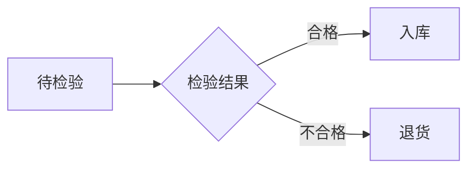
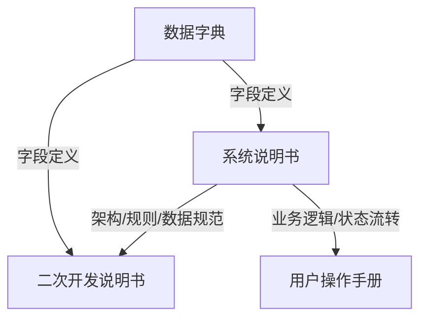

# IMS 文档编写规范 v2.0

> **文档版本**：v2.0 | **更新日期**：2026-09-17 | **作者**：文档组
>
> 本文档规定 IMS 系统说明书、用户操作手册、二次开发说明书的编写格式、风格与维护流程。所有文档编写者（含 Trae AI）必须遵守。

---

## 一、文档体系总览

### 1.1 适用场景

本规范覆盖 IMS 项目的三类核心文档：

| 文档 | 定位 | 读者 |
|------|------|------|
| **系统说明书** | 系统架构、业务逻辑、数据规范、安全机制 | 管理员、IT人员、业务负责人 |
| **用户操作手册** | 各角色日常操作步骤与常见问题 | 来料检、仓库管理员、生产主管、测试工程师、总经理 |
| **二次开发说明书** | 开发环境搭建、代码结构、后端/前端/数据库规范、部署运维 | 开发人员、二次开发团队 |

### 1.2 实际目录结构

```
docs/
├── 文档编写规范.md              ← 本文件
├── 二期检查规范.md              ← 二期开发验收标准
├── 系统说明书/
│   └── IMS系统说明书.md         ← 单文件，按章组织
├── 用户操作手册/
│   └── IMS用户操作手册.md       ← 单文件，按章组织
├── 二次开发说明书/
│   ├── 00-文档使用指南.md
│   ├── 01-开发环境搭建.md
│   ├── 02-代码结构详解.md
│   ├── 03-后端开发规范.md
│   ├── 04-前端开发规范.md
│   ├── 05-数据库设计规范.md
│   ├── 06-测试规范.md
│   ├── 07-部署与运维.md
│   ├── 08-常见二次开发场景.md
│   ├── 09-二期拓展评估清单.md
│   ├── 10-避坑指南.md
│   ├── 11-代码质量检查.md
│   └── 12-附录.md
└── 附录/
    └── 数据字典.md              ← 脚本自动生成，禁止手动编辑
```

**说明**：
- 系统说明书和用户操作手册采用**单文件**格式，便于整体阅读和打印
- 二次开发说明书采用**分文件**格式（13个独立 .md），便于按主题查阅和维护
- 数据字典由 `backend/scripts/generate_data_dict.py` 自动生成，**禁止手动编辑**

### 1.3 导出格式

| 格式 | 用途 | 工具 |
|------|------|------|
| **.md**（源文件） | 版本控制、持续更新 | VS Code / 任意编辑器 |
| **.docx** | 正式交付、打印、分发 | Markdown → pandoc 或手动排版 |

> 项目当前不强制配置 VitePress/Pandoc 自动化工具链，优先保证 Markdown 源文件的质量和一致性。

---

## 二、Markdown 编写规范

### 2.1 标题层级

```markdown
# 一级标题：文档标题（每个 .md 文件只有一个）
## 二级标题：章标题
### 三级标题：节标题
#### 四级标题：小节标题（尽量不超过四级）
```

**规则**：
- 每个 `.md` 文件只有一个 `#` 一级标题
- 标题层级不超过四级，超过时考虑拆分章节
- 标题编号使用数字（如 `## 2.1 主线A：采购来料管理`）
- 标题后紧跟一个空行

### 2.2 段落与换行

- 段落之间空一行
- 中文段落首行不缩进
- 重要提示使用 `⚠️` 前缀并加粗：`**⚠️ 注意**：内容`
- 行内代码使用反引号：`` `PENDING_INSPECTION` ``

### 2.3 表格

```markdown
| 字段名 | 类型 | 必填 | 默认值 | 说明 |
|--------|------|:---:|--------|------|
| id | Integer | ✅ | 自增 | 主键 |
| item_sn | String(50) | ✅ | — | 单品SN，唯一 |
```

**规则**：
- 表头与内容用 `|` 分隔，对齐行用 `-`
- 居中对齐用 `:---:`，左对齐用 `:---`，右对齐用 `---:`
- 必填列用 ✅ / ❌
- 空值用 `—` 表示（破折号，非减号）
- 表格前后各空一行
- 表头必须有对齐标记（不允许 `|a|b|` 这种无对齐行的写法）

### 2.4 代码块

````markdown
```python
def example():
    """代码示例。"""
    pass
```
````

**规则**：
- **必须标注语言类型**：`python`、`bash`、`sql`、`json`、`yaml`、`javascript`、`vue` 等
- 代码块前后各空一行
- 长命令可换行，用 `\` 续行

### 2.5 列表

```markdown
- 无序列表项
- 无序列表项
  - 嵌套子项（缩进2个空格）

1. 有序列表项
2. 有序列表项
   1. 嵌套子项（缩进3个空格）
```

**规则**：
- 无序列表用 `-`，不用 `*`
- 嵌套缩进 2 个空格
- 列表项之间一般不空行，除非列表项内容超过 3 行

### 2.6 强调用法

| 格式 | 用途 | 示例 |
|------|------|------|
| `**加粗**` | 关键术语、按钮名称、重要提示 | **新增**、**保存**、**提交** |
| `*斜体*` | 英文术语、注释 | *Serial Number* |
| `` `代码` `` | 字段名、状态值、文件路径、命令、角色名 | `item_sn`、`PENDING_INSPECTION`、`WAREHOUSE` |

### 2.7 链接

```markdown
[链接文字](相对路径/文件名.md)
[链接文字](相对路径/文件名.md#章节标题)
```

**规则**：
- 文档内部跳转用**相对路径**（以 `docs/` 为根目录的相对路径）
- **禁止使用绝对路径**（如 `C:\Users\...` 或 `/home/...`）
- 外部链接必须可访问

### 2.8 图片

```markdown

```

**规则**：
- 图片放在对应文档目录下的 `images/` 文件夹
- 截图格式统一使用 PNG
- 命名规则：`模块-功能-描述.png`（如 `incoming-检验报告-填写界面.png`）
- 图片描述**不可为空**
- 截图分辨率建议 1920×1080，必要时裁剪

### 2.9 Mermaid 图表

````markdown

````

**规则**：
- 所有流程图、状态图使用 Mermaid 语法
- 图表前后各空一行
- 状态节点名使用代码中的实际枚举值

### 2.10 提示框

```markdown
> **⚠️ 注意**：这是重要提示内容。

> **📊 核心指标**：待检验数量、不合格率。

> **💡 技巧**：批量操作时建议先导出确认数据。

> **❌ 禁止**：入库确认后不可撤销。
```

**规则**：
- 使用引用块 `>` 表示提示框
- `⚠️` — 警告/注意事项
- `📊` — 指标/数据
- `💡` — 技巧/建议
- `❌` — 禁止/错误操作

---

## 三、文档内容规范

### 3.1 语言风格

| 项目 | 规范 |
|------|------|
| 语言 | 简体中文 |
| 语气 | 客观、专业、简洁 |
| 人称 | 避免"我"、"你"，用"用户"、"操作者"或直接省略主语 |
| 时态 | 一般现在时 |
| 术语 | 首次出现加中文说明，如：SN（Serial Number，设备序列号） |

### 3.2 操作步骤写法

**仅用于《用户操作手册》。**

```markdown
**步骤1：进入模块**

1. 点击左侧菜单 → **采购来料管理** → **到货登记**
2. 系统显示到货单列表页面

**步骤2：新增到货单**

1. 点击 **新增** 按钮
2. 在弹出的表单中填写必填字段
3. 点击 **提交** → 系统生成到货单编号，跳转回列表页
```

**规则**：
- 每个步骤以 `**步骤N：标题**` 开头
- 操作路径用 `→` 连接
- 按钮名称**加粗**
- 结果用 `→` 引出状态变化

### 3.3 数据表说明写法

**原则**：字段定义以《数据字典》为单一数据源，文档中不手写完整字段表格。

**正确写法**（引用数据字典）：

```markdown
#### X.X.X 表名

> 完整字段定义详见《数据字典》→ 模块名 → 表名。

**业务用途**：描述表的业务含义、使用场景。

**关键字段**：`status`（状态控制流转）、`sn`（一物一码关联库存）。
```

**禁止写法**：

```markdown
# ❌ 禁止在系统说明书和用户操作手册中手写字段类型表
| 字段 | 类型 | 必填 | 说明 |
|------|------|:---:|------|
| `field1` | String(50) | ✅ | ... |
```

### 3.4 状态枚举说明写法

```markdown
| 状态值 | 含义 | 可执行操作 |
|--------|------|-----------|
| `PENDING` | 待处理 | 编辑、提交 |
| `APPROVED` | 已审批 | 查看、打印 |
| `REJECTED` | 已驳回 | 重新提交 |
```

### 3.5 API 接口文档格式

**仅用于《二次开发说明书》。**

```markdown
### POST /api/v1/inbound-orders

| 属性 | 值 |
|------|-----|
| 方法 | `POST` |
| 路径 | `/api/v1/inbound-orders` |
| 权限 | `WAREHOUSE` |
| 请求体 | `InboundOrderCreate` |
| 响应体 | `R[InboundOrderOut]` |
| 说明 | 创建入库单 |

**请求体示例**：

```json
{
    "order_no": "JIN-20240910-001",
    "partner_id": 1,
    "lines": [...]
}
```
```

**规则**：
- 属性表固定七行：方法、路径、权限、请求体、响应体、说明
- 响应体使用 `R[...]` 包裹表示统一响应格式
- 权限列写角色枚举值，多个用逗号分隔

### 3.6 代码片段引用规范

**仅用于《二次开发说明书》。**

| 规则 | 说明 |
|------|------|
| 短代码（≤30行） | 直接粘贴完整代码块 |
| 长代码（>30行） | 只粘贴关键行，在代码块上方注明完整文件路径 |
| 跨章节引用 | 使用文件路径 + 行号引用，不重复粘贴 |

---

## 四、文档维护规范

### 4.1 版本标识

每份文档首页必须标注版本信息：

```markdown
> **文档版本**：v1.0 | **更新日期**：2026-09-17 | **作者**：文档组
```

### 4.2 变更记录

建议在文档开头的版本记录表中登记：

```markdown
| 版本 | 日期 | 变更内容 | 作者 |
|------|------|----------|------|
| v1.0 | 2026-09-10 | 初版 | 文档组 |
| v1.1 | 2026-09-15 | 新增主线B报废流程 | 文档组 |
```

### 4.3 更新流程

1. 系统功能变更 → 同步更新对应文档章节
2. 在变更记录中登记
3. 检查数据字典是否需要重新生成
4. 必要时通知相关人员

### 4.4 数据字典维护

```bash
# 进入后端目录，运行生成脚本
cd backend
python scripts/generate_data_dict.py --output ../docs/附录/数据字典.md
```

数据字典由脚本自动扫描数据库模型生成，**禁止手动编辑**。每次新增或修改 Model 后必须重新生成。

---

## 五、Git 提交规范

### 5.1 提交信息格式

```
docs: 更新系统说明书第4章业务线详解

- 新增主线A采购来料管理
- 新增主线B成品返厂维修
```

### 5.2 提交类型前缀

| 前缀 | 说明 |
|------|------|
| `docs:` | 文档更新/新增 |
| `docs:fix:` | 文档错误修正 |

---

## 六、Trae 编写检查清单

> 编写（或由 Trae AI 代写）每章/每节后，必须逐项自查以下清单。

### 6.1 通用检查（所有文档）

- [ ] 标题层级正确（不超过四级，每文件仅一个一级标题）
- [ ] 所有状态值、枚举值使用代码格式（`` `STATUS` ``）
- [ ] 所有按钮名称加粗（**按钮**）
- [ ] 所有表格有表头对齐标记
- [ ] 所有 Mermaid 图表标注了语言类型
- [ ] 注意事项用 `⚠️` 前缀
- [ ] 代码块标注了语言类型
- [ ] 表格前后有空行
- [ ] 无连续空行超过 2 行
- [ ] 无绝对路径引用
- [ ] 所有状态值/枚举值/字段名与代码中一致

### 6.2 用户操作手册专属

- [ ] 操作步骤使用 `**步骤N：标题**` 格式
- [ ] 路径使用 `→` 连接
- [ ] 每个步骤 3~7 个小步骤
- [ ] 首次出现的术语有中文说明

### 6.3 系统说明书专属

- [ ] 数据表说明引用数据字典，未手写字段类型表
- [ ] 英文术语首次出现有中文全称
- [ ] Mermaid 状态图节点名与代码枚举值一致

### 6.4 二次开发说明书专属

- [ ] 代码块标注了文件路径
- [ ] 长代码（>30行）只贴关键行
- [ ] API 文档属性表七行完整
- [ ] 跨章节引用使用文件路径 + 行号

---

## 七、文档间引用规范

### 7.1 三份文档的关系



### 7.2 内容分工

| 内容 | 系统说明书 | 用户操作手册 | 二次开发说明书 |
|------|:---:|:---:|:---:|
| 系统架构 | ✅ | — | 简述 |
| 业务流程与规则 | ✅ | — | — |
| 数据规范/表结构 | 概述+引用数据字典 | — | ✅ |
| 角色与权限 | ✅ | — | ✅ |
| 操作步骤（点击→输入→提交） | — | ✅ | — |
| 常见问题 FAQ | — | ✅ | — |
| 开发环境搭建 | — | — | ✅ |
| API 接口文档 | — | — | ✅ |
| 数据库迁移 | — | — | ✅ |
| 部署运维 | — | — | ✅ |
| 测试规范 | — | — | ✅ |

### 7.3 交叉引用写法

```markdown
> 📋 详细操作步骤请参阅《用户操作手册》→ 第X章
> 📋 字段定义详见《数据字典》→ 模块名 → 表名
> 📋 开发细节参见《二次开发说明书》→ 第X章
```

---

## 八、版本历史

| 版本 | 日期 | 变更内容 | 作者 |
|------|------|----------|------|
| v2.0 | 2026-09-17 | 重写：适配项目 v2.9 实际状态；简化导出工具链；更新目录结构；新增文档间引用规范 | 文档组 |
| v1.1 | 2026-09-15 | 新增二次开发说明书专属规范（第七章）；更新目录结构 | 文档组 |
| v1.0 | 2026-09-10 | 初版 | 文档组 |