# IMS 生产物料与产品追溯管理系统 — 系统说明书

> **文档版本**：v2.0 | **更新日期**：2026-09-17 | **作者**：文档组

---

## 第0章 文档使用指南

### 0.1 本文档的定位

本文档面向管理员、IT人员、业务负责人，讲清楚 IMS 系统的架构全貌、业务逻辑、数据规范与安全机制。本文档**不包含**具体操作步骤，操作步骤请参阅《IMS 用户操作手册》。

### 0.2 不同角色的阅读路径

| 角色 | 必读章节 | 选读章节 |
|------|----------|----------|
| ADMIN / IT 人员 | 全部 | — |
| 业务负责人 | 第2章、第4-6章、第8章 | 第3章 |
| 开发人员 | 第3章、第6章、附录B | 第4-5章 |
| 新员工 | 第2章、第4章、第7章 | 附录A |

### 0.3 文档版本记录

| 版本 | 日期 | 变更内容 | 作者 |
|------|------|----------|------|
| v1.0 | 2026-09-10 | 初版，基于代码实际分析 | 文档组 |

### 0.4 文档更新流程

1. 系统功能变更 → 同步更新对应文档章节
2. 在版本记录中登记变更内容
3. 变更影响范围评估
4. 评审 → 发布 → 重新导出 PDF/HTML

---

## 第1章 文档说明

### 1.1 编写目的

本文档旨在为 IMS 系统的管理员、IT人员、业务负责人提供系统架构、业务逻辑、数据规范与安全机制的完整参考。

### 1.2 适用范围

本文档适用于 IMS 生产物料与产品追溯管理系统 v2.9。

### 1.3 读者对象

- **管理员 / IT人员**：负责系统部署、维护、用户管理
- **业务负责人**：负责业务流程规划、数据规范制定
- **开发人员**：负责二次开发、系统对接

### 1.4 术语与缩写

| 术语 | 全称 | 说明 |
|------|------|------|
| SN | Serial Number | 设备序列号，一物一码的核心标识 |
| SKU | Stock Keeping Unit | 库存单位，即物料编码 |
| BOM | Bill of Materials | 物料清单 |
| RMA | Return Material Authorization | 退料授权，即返厂维修管理 |
| RC | Receipt | 到货单编号前缀 |
| FC | Factory Comeback | 返厂单编号前缀 |
| SH | Shipment | 出货单编号前缀 |
| BF | BaoFei | 报废单编号前缀 |
| WX | WeiXiu | 维修工单编号前缀 |
| DG | Diagnosis | 诊断报告编号前缀 |
| RH | Reship | 再出货单编号前缀 |
| JIN | — | 入库单编号前缀 |
| JOUT | — | 出库单编号前缀 |
| PR | Production | 生产任务编号前缀 |

### 1.5 相关文档

- 《IMS 用户操作手册》
- 《IMS 检测项目清单》
- 《IMS 数据库设计文档》

---

## 第2章 系统概述

### 2.1 项目背景与目标

IMS是为设备生产企业量身定制的**物料与产品追溯管理系统**。随着企业生产规模扩大，传统的手工记账和Excel管理方式已无法满足需求：
- 设备SN管理混乱，无法追溯来源和去向
- 返厂维修流程不透明，周转周期长
- 采购、生产、出货、售后各环节数据割裂
- 缺乏统一的物料齐套检查机制

IMS的目标是**一物一码、全链追溯**，实现从采购到售后的闭环管理。

### 2.2 系统定位与价值

IMS 面向设备生产企业，提供物料与产品的**全生命周期追溯**能力，覆盖采购来料 → 生产 → 出货 → 售后 → 维修 → 再出货全链条。

### 2.3 四条核心业务线概览

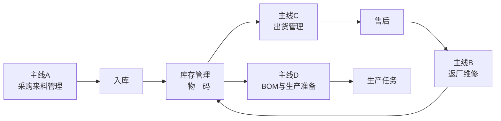

### 2.4 系统边界

IMS系统的职责范围如下：

- **包含**：物料与产品从采购到货 → 检验入库 → 生产/出货 → 返厂维修 → 再出货的全生命周期追溯
- **不包含**：财务核算、ERP/MRP详细排产、HR管理、CRM客户关系管理
- **对接**：预留U9系统接口（`sku_code`、`u9_task_no`字段），支持未来ERP集成

---

## 第3章 系统架构与技术栈

### 3.1 总体架构

IMS采用前后端分离的B/S架构：

```text
┌─────────────────────────────────────────────────┐
│                    浏览器 (Browser)               │
├─────────────────────────────────────────────────┤
│  Vue 3 SPA  │  Element Plus  │  Pinia  │  Vite  │
├─────────────────────────────────────────────────┤
│                 HTTP / REST API                   │
├─────────────────────────────────────────────────┤
│         FastAPI  │  SQLAlchemy  │  Alembic       │
├─────────────────────────────────────────────────┤
│                  MySQL 8.0                        │
├─────────────────────────────────────────────────┤
│           Docker  │  Nginx 反向代理              │
└─────────────────────────────────────────────────┘
```

### 3.2 技术选型说明

| 层面 | 技术 | 说明 |
|------|------|------|
| 前端 | Vue 3 + Element Plus + Pinia + Vite | SPA 单页应用 |
| 后端 | FastAPI + SQLAlchemy + Alembic | RESTful API |
| 数据库 | MySQL 8.0 | 关系型数据库 |
| 部署 | Docker + Nginx | 容器化部署 |

### 3.3 模块全景

系统共划分为以下功能模块：

| 模块 | 说明 | 对应角色 |
|------|------|----------|
| 仪表盘 | 待办统计、库存总览、出货统计 | 所有角色 |
| 库存查询 | 实时库存、单品轨迹、库存快照 | 所有角色 |
| 入库管理 | 采购入库、非采购入库、入库审核 | WAREHOUSE |
| 出库管理 | 11种出库类型、拣货确认、出库审核 | WAREHOUSE |
| 来料管理 | 到货单、检验报告、退货单、打印 | QUALITY, WAREHOUSE |
| 返厂维修 | 诊断、分配、维修、质检、入库、再出货 | 多角色协作 |
| 出货管理 | 出货单、SN列表、物流信息 | WAREHOUSE |
| BOM管理 | BOM创建、编辑、版本、导入导出 | PRODUCTION |
| 生产任务 | 任务创建、物料齐套检查 | PRODUCTION |
| 商品SKU | 物料编码、规格、供应商管理 | 多角色共享 |
| 往来单位 | 供应商、客户、物流商管理 | 多角色共享 |
| 业务流程 | 全业务线单据流转查看 | 所有角色 |
| 系统设置 | 品牌、参数、用户管理 | ADMIN |
| 审计日志 | 操作记录、变更追踪、导出 | ADMIN |
| 场站管理 | 场站信息、位置、状态维护 | ADMIN, WAREHOUSE |
| 设备台账 | 设备全生命周期档案、保养记录 | WAREHOUSE, ADMIN |
| 盘点管理 | 库存盘点计划、盘点执行、差异处理 | WAREHOUSE, ADMIN |
| 库存调整 | 库存数量/状态调整、审批流程 | WAREHOUSE, ADMIN |
| 数据看板 | 可视化图表、关键指标大屏展示 | 所有角色 |

### 3.3.1 角色定义与权限矩阵

系统共定义 6 个角色，按职责分离原则分配权限：

| 角色 | 代码 | 用户 | 职责概要 |
|------|------|------|----------|
| 管理员/总经理 | `ADMIN` | 左文峰（zwf） | 系统管理、报废审批、用户管理、审计查看 |
| 仓库管理员 | `WAREHOUSE` | 赵丹（zd） | 入库/出库/到货登记/入库确认/出货/盘点/场站 |
| 质量负责人 | `QUALITY` | 吕芳强（lfq） | 来料检验、设备诊断、维修质检、任务分配 |
| 生产主管 | `PRODUCTION` | 颜冬（yd）、乔森（qs） | BOM管理、生产任务、外观维修 |
| 测试工程师 | `TEST_ENGINEER` | 刘晓娟、何奔、赵建飞、左留启 | 功能维修、设备诊断 |
| 普通员工 | `STAFF` | 群众（qz） | 仅查看权限 |

**后端API权限校验规则**：

| API模块 | 操作 | 所需角色 |
|---------|------|----------|
| 用户管理 | 全部 | `ADMIN` 专属 |
| 审计日志 | 查看 | `ADMIN` 专属 |
| 系统设置 | 全部 | `ADMIN` 专属 |
| 场站管理 | CRUD | `ADMIN` + `WAREHOUSE` |
| 到货单登记 | 新增/确认 | `ADMIN` + `WAREHOUSE` |
| 来料检验 | 创建检验报告 | `ADMIN` + `QUALITY` |
| 来料退货 | 创建退货单 | `ADMIN` + `WAREHOUSE` |
| 返厂诊断 | 创建诊断报告 | `ADMIN` + `QUALITY`（规划中） |
| 维修操作 | 执行维修 | `ADMIN` + `PRODUCTION`（规划中） |
| 维修质检 | 创建质检报告 | `ADMIN` + `QUALITY`（规划中） |
| 入库确认 | 维修入库 | `ADMIN` + `WAREHOUSE`（规划中） |
| 报废审批 | 审批报废 | `ADMIN` 专属 |
| 出货管理 | 全部 | `ADMIN` + `WAREHOUSE`（规划中） |
| BOM管理 | 编辑 | `ADMIN` + `PRODUCTION` |

> 标注"规划中"的模块当前后端已实现但API尚未强制角色校验，前端菜单已按角色限制显示。

### 3.3.2 半成品（SEMI_FINISHED）说明

半成品是系统中连接原材料与成品的中间物料层级，支持多级BOM结构。

**定义**：经过部分加工、需进一步组装才能成为成品的中间产物。

**存储仓库**：
| 仓库类型 | 代码 | 说明 |
|----------|------|------|
| 半成品仓 | `SEMI_FINISHED` | 正常生产产出的半成品 |
| 零成本半成品仓 | `ZERO_COST_SEMI` | 维修后入库的半成品 |

**使用场景**：
1. **BOM多层结构**：成品BOM → 半成品作为子组件 → 原材料作为零件
2. **生产任务产出**：创建生产任务时选择 `product_type=SEMI_FINISHED`，产出半成品
3. **下级BOM输入**：半成品作为下级BOM的"成品"，消耗原材料产出

**流程**：


### 3.4 核心数据模型

> 完整字段定义、类型、约束详见《数据字典》（`docs/附录/数据字典.md`），由 `generate_data_dict.py` 自动生成。
> 本文档仅描述业务含义与使用场景。

| 模型 | 表名 | 用途 |
|------|------|------|
| IncomingReceipt | `incoming_receipt` | 到货单，记录采购来料的到货信息 |
| IncomingInspection | `incoming_inspection` | 来料检验报告 |
| IncomingReturn | `incoming_return` | 原材料退货单 |
| RmaReturn | `rma_return` | 返厂退货单（主线B主表） |
| RmaDiagnosis | `rma_diagnosis` | 诊断报告 |
| RmaRepair | `rma_repair` | 维修工单 |
| RmaQualityCheck | `rma_quality_check` | 质量检验报告 |
| RmaWarehouseIn | `rma_warehouse_in` | 维修后入库审核 |
| RmaScrap | `rma_scrap` | 报废审批单 |
| RmaReship | `rma_reship` | 再出货单 |
| Shipment | `shipment` | 出货单 |
| BomHeader | `bom_header` | BOM主表 |
| BomDetail | `bom_detail` | BOM明细（支持多级层级） |
| ProductionTask | `production_task` | 生产任务 |
| InventoryItem | `inventory_item` | 库存单品（一物一码核心表） |
| ProductSku | `product_sku` | 商品SKU |
| Partner | `partner` | 往来单位 |
| AuditLog | `audit_log` | 审计日志 |
| Station | `station` | 场站信息 |
| DeviceLedger | `device_ledger` | 设备台账 |
| Stocktake | `stocktake` | 盘点单 |
| InventoryAdjustment | `inventory_adjustment` | 库存调整单 |
| Customer | `customer` | 客户信息（扩展8字段） |

### 3.5 部署方式

系统支持Docker容器化部署：

- **前端**：Vite构建静态文件，Nginx提供Web服务
- **后端**：FastAPI + Uvicorn，通过Docker Compose编排
- **数据库**：MySQL 8.0，数据持久化到宿主机Volume
- **部署脚本**：`docker-compose.yml` 统一管理各服务

详细部署步骤请参考项目 `README.md` 和 `docker-compose.yml` 配置文件。

---

## 第4章 业务线详解

### 4.1 主线A：采购来料管理

#### 4.1.1 功能概述

主线A覆盖从供应商到货到原材料入库的完整流程。核心角色为**来料检/质量负责人**（`QUALITY`）和**仓库管理员**（`WAREHOUSE`）。

**业务场景**：供应商发货 → 仓库登记到货 → 来料检检验 → 合格入库 / 不合格退货。

#### 4.1.2 核心数据表

| 表名 | 说明 | 关键字段 |
|------|------|----------|
| `incoming_receipt` | 到货单 | `receipt_no`(RC编号)、`supplier_id`、`sku_id`、`batch_no`、`status` |
| `incoming_inspection` | 检验报告 | `inspection_no`、`receipt_id`、`sample_qty`、`defect_qty`、`result` |
| `incoming_return` | 退货单 | `return_no`、`receipt_id`、`return_qty`、`return_reason` |

#### 4.1.3 状态流转

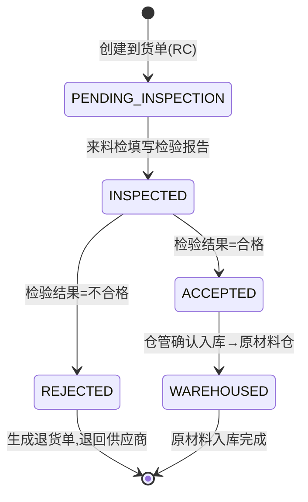

#### 4.1.4 状态枚举说明

| 状态值 | 含义 | 可执行操作 | 操作角色 |
|--------|------|-----------|----------|
| `PENDING_INSPECTION` | 待检验 | 填写检验报告 | QUALITY |
| `INSPECTED` | 已检验 | 根据检验结果流转 | — |
| `ACCEPTED` | 检验合格 | 仓管确认入库 | WAREHOUSE |
| `REJECTED` | 检验不合格 | 生成退货单、确认退货 | WAREHOUSE |
| `WAREHOUSED` | 已入库 | 流程结束 | — |

> **检验结果说明**：检验报告中的 `result` 字段有三种取值：`ACCEPTED`（合格）、`CONCESSION_ACCEPTED`（让步接收）、`REJECTED`（不合格）。其中让步接收和合格入库都会进入 `ACCEPTED` 状态，仅检验报告中记录差异。

#### 4.1.5 关键字段说明

> 完整字段定义（类型、必填、默认值）详见《数据字典》→ **主线A：采购来料管理**。
>
> **关键表**：
> - `incoming_receipt`（到货单）— `status`：`PENDING_INSPECTION` → `ACCEPTED` / `REJECTED` 控制流转
> - `incoming_inspection`（检验报告）— `result`：`ACCEPTED` / `CONCESSION_ACCEPTED` / `REJECTED`
> - `incoming_return`（退货单）— `status`：`PENDING` / `CONFIRMED`
>
> **字段关联**：`supplier_id` → `partner.id`，`sku_id` → `product_sku.id`，`inspector_id` → `user.id`

#### 4.1.6 操作流程

**步骤1：仓库管理员登记到货**

1. 进入来料管理 → 点击 **新增到货单**
2. 选择供应商、物料SKU、填写批次号
3. 填写到货数量、到货日期
4. 点击 **提交** → 到货单状态变为 `PENDING_INSPECTION`
5. 可打印到货单

**步骤2：来料检填写检验报告**

1. 进入来料管理 → 查看待检验到货单
2. 点击 **检验** → 填写检验报告
3. 输入抽样数量、不良数量、不良描述
4. 选择检验结果：合格 / 让步接收 / 不合格
5. 点击 **提交** → 到货单状态变为 `INSPECTED`
6. 可打印检验报告

**步骤3：仓库管理员确认入库**

1. 检验合格/让步接收的到货单 → 点击 **入库确认**
2. 系统自动创建入库单，物料进入原材料仓（`RAW_MATERIAL`）
3. 到货单状态变为 `WAREHOUSED`

**步骤4：处理不合格退货**

1. 检验不合格的到货单 → 状态变为 `REJECTED`
2. 仓库管理员确认退货数量与退货原因
3. 点击 **确认退货** → 退货单状态变为 `CONFIRMED`
4. 可打印退货单

#### 4.1.7 注意事项

- ⚠️ 到货单创建后状态为 `PENDING_INSPECTION`，此时不可入库
- ⚠️ 让步接收与合格入库在库存层面无区别，仅在检验报告中记录差异
- ⚠️ 退货数量不能超过到货数量，系统自动校验
- ⚠️ 入库确认后库存立即生效，不可撤销
- ⚠️ 所有状态变更操作均需填写变更原因（`change_reason`），并写入审计日志

---

### 4.2 主线B：成品返厂维修

#### 4.2.1 功能概述

主线B是系统最复杂的业务线，覆盖从客户退货到维修后再出货的完整闭环。涉及角色最多：**来料检/质量负责人**（`QUALITY`）、**测试工程师**（`TEST_ENGINEER`）、**生产主管**（`PRODUCTION`）、**仓库管理员**（`WAREHOUSE`）、**总经理**（`ADMIN`）。

**业务场景**：客户退货 → 诊断故障 → 分配任务 → 维修（换新SN）→ 质量检验 → 零成本仓入库 → 再出货 / 报废审批。

#### 4.2.2 核心数据表

| 表名 | 说明 | 编号前缀 | 关键字段 |
|------|------|:---:|------|
| `rma_return` | 返厂退货单 | FC | `sn`、`sku_id`、`return_reason`、`status`、`assigned_to`、`assign_type` |
| `rma_diagnosis` | 诊断报告 | DG | `diagnosis_no`、`fault_description`、`diagnosis_result` |
| `rma_repair` | 维修工单 | WX | `repair_no`、`old_sn`、`new_sn`、`materials_used`、`fault_code` |
| `rma_quality_check` | 质量检验 | — | `check_result`(PASS/FAIL) |
| `rma_warehouse_in` | 入库审核 | — | `new_sn`、`warehouse_type`(默认零成本仓) |
| `rma_scrap` | 报废审批单 | BF | `scrap_no`、`scrap_reason`、`status`(审批状态) |
| `rma_reship` | 再出货单 | RH | `reship_no`、`new_sn`、`recipient` |

#### 4.2.3 状态流转

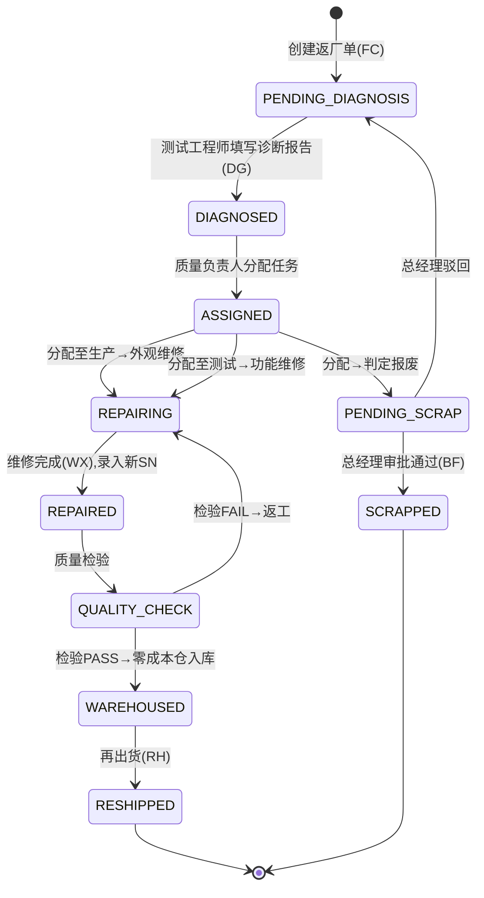

#### 4.2.4 状态枚举说明

| 状态值 | 含义 | 可执行操作 | 操作角色 |
|--------|------|-----------|----------|
| `PENDING_DIAGNOSIS` | 待诊断 | 填写诊断报告 | TEST_ENGINEER |
| `DIAGNOSED` | 已诊断 | 分配维修任务 | QUALITY |
| `ASSIGNED` | 已分配 | 开始维修 | PRODUCTION / TEST_ENGINEER |
| `REPAIRING` | 维修中 | 完成维修 | PRODUCTION / TEST_ENGINEER |
| `REPAIRED` | 已修复 | 质量检验 | QUALITY |
| `QUALITY_CHECK` | 质量检验 | PASS→入库 / FAIL→返工 | QUALITY |
| `WAREHOUSED` | 已入库 | 再出货 | WAREHOUSE |
| `RESHIPPED` | 已再出货 | 流程结束 | — |
| `PENDING_SCRAP` | 待报废审批 | 审批通过/驳回 | ADMIN |
| `SCRAPPED` | 已报废 | 流程结束 | — |

#### 4.2.5 关键字段说明

> 完整字段定义（类型、必填、默认值）详见《数据字典》→ **主线B：成品返厂维修**。
>
> **核心7表**：
> | 表 | 编号前缀 | 核心状态字段 |
> |-----|---------|-------------|
> | `rma_return` | FC | `status` — 10节点状态流转 |
> | `rma_diagnosis` | DG | `diagnosis_result` — `REPAIRABLE` |
> | `rma_repair` | WX | `old_sn` / `new_sn` — SN换码映射 |
> | `rma_quality_check` | — | `check_result` — `PASS` / `FAIL` |
> | `rma_warehouse_in` | — | `warehouse_type` — `ZERO_COST_FINISHED` |
> | `rma_scrap` | BF | `status` — `PENDING` / `APPROVED` / `REJECTED` |
> | `rma_reship` | RH | `new_sn` — 出货SN |
>
> **关键业务字段**：
> - `assign_type`：分配类型 `PRODUCTION` / `TEST`
> - `warehouse_type`：入库仓 `ZERO_COST_FINISHED` / `ZERO_COST_SEMI`
> - `new_sn`：换码后新SN，必须唯一，系统自动校验

#### 4.2.6 关键业务规则

**SN新旧替换机制**

维修换码是主线B的核心机制。当设备维修后需要更换SN时：

- 旧SN通过 `replaced_by_sn` 指向新SN，旧SN状态变为 `REPLACED`，生命周期结束
- 新SN通过 `replaced_from_sn` 指向旧SN，新SN进入零成本仓（`ZERO_COST_FINISHED` 或 `ZERO_COST_SEMI`）
- 维修工单（`rma_repair`）记录 `old_sn` → `new_sn` 的映射关系
- ⚠️ 新SN必须唯一，系统自动校验，不允许与已有SN重复

**零成本仓入库规则**

- 维修完成后的成品入库到零成本仓（`ZERO_COST_FINISHED`），而非普通成品仓（`FINISHED`）
- 零成本仓的物料在财务核算上不计入库存成本，区别于正常采购入库的成品
- 半成品维修后入库到 `ZERO_COST_SEMI`

**报废审批流程**

- 质量负责人分配任务时选择分配类型为 `SCRAP`，返厂单进入 `PENDING_SCRAP` 状态
- 系统自动创建报废审批单（BF编号），状态为 `PENDING`
- 仅总经理（`ADMIN`）有权审批报废单
- 审批通过 → 返厂单状态变为 `SCRAPPED`，设备报废
- 审批驳回 → 填写驳回原因，返厂单退回 `PENDING_DIAGNOSIS` 状态
- ⚠️ 审批通过后不可撤销

**分配类型说明**

| 分配类型 | 代码 | 含义 | 接收角色 |
|----------|------|------|----------|
| 生产 | `PRODUCTION` | 外观问题，由生产主管处理 | PRODUCTION |
| 测试 | `TEST` | 功能问题，由测试工程师处理 | TEST_ENGINEER |
| 报废 | `SCRAP` | 判定报废，进入审批流程 | ADMIN（审批） |

#### 4.2.7 操作流程

**步骤1：仓库管理员登记返厂退货**

1. 进入返厂维修 → 点击 **新增返厂单**
2. 选择物料SKU、输入设备SN、填写退货原因
3. 填写退货日期、客户名称
4. 点击 **提交** → 返厂单状态变为 `PENDING_DIAGNOSIS`

**步骤2：测试工程师填写诊断报告**

1. 进入返厂维修 → 查看待诊断返厂单
2. 点击 **诊断** → 填写诊断报告
3. 输入故障描述、选择诊断结果（`REPAIRABLE`）
4. 填写维修方案
5. 点击 **提交** → 生成诊断报告（DG编号），返厂单状态变为 `DIAGNOSED`

**步骤3：质量负责人分配维修任务**

1. 进入返厂维修 → 查看已诊断返厂单
2. 点击 **分配** → 选择分配类型（生产/测试/报废）
3. 选择分配人
4. 填写分配原因
5. 点击 **提交** → 返厂单状态变为 `ASSIGNED`

**步骤4：生产主管/测试工程师执行维修**

1. 进入返厂维修 → 筛选"分配给我"
2. 点击 **维修** → 状态变为 `REPAIRING`
3. 填写维修描述、维修用料、故障码
4. 如需换码 → 输入新SN（⚠️ 系统自动校验唯一性）
5. 填写维修耗时
6. 点击 **完成维修** → 生成维修工单（WX编号），返厂单状态变为 `REPAIRED`

**步骤5：质量负责人进行质量检验**

1. 进入返厂维修 → 查看已修复返厂单
2. 点击 **质检** → 填写检验描述
3. 选择检验结果：`PASS`(通过) / `FAIL`(不通过)
4. 点击 **提交** → PASS进入 `QUALITY_CHECK` 状态，FAIL退回 `REPAIRING` 状态

**步骤6：仓库管理员入库确认**

1. 质检通过的返厂单 → 点击 **入库**
2. 确认新SN、选择仓库类型（默认零成本仓-成品）
3. 点击 **确认入库** → 返厂单状态变为 `WAREHOUSED`，新SN进入零成本仓

**步骤7：仓库管理员再出货**

1. 已入库的返厂单 → 点击 **再出货**
2. 填写收货人、出货日期
3. 点击 **提交** → 生成再出货单（RH编号），返厂单状态变为 `RESHIPPED`

**步骤8：总经理审批报废（如适用）**

1. 进入返厂维修 → 查看待审批报废单 或 仪表盘待办
2. 点击 **审批** → 查看报废原因
3. 选择：通过 → 设备报废（`SCRAPPED`）/ 驳回 → 填写原因 → 退回诊断
4. ⚠️ 审批通过后不可撤销

#### 4.2.8 注意事项

- ⚠️ 诊断报告提交后，返厂单状态从 `PENDING_DIAGNOSIS` 变为 `DIAGNOSED`，不可回退
- ⚠️ 分配类型为 `SCRAP` 时，系统自动创建报废审批单，需总经理审批
- ⚠️ 新SN必须唯一，系统自动校验，重复时无法提交
- ⚠️ 质量检验 `FAIL` 后，返厂单自动退回 `REPAIRING` 状态，需重新维修
- ⚠️ 入库确认后物料进入零成本仓（`ZERO_COST_FINISHED`），区别于普通成品仓
- ⚠️ 报废审批通过后不可撤销，旧SN状态变为 `SCRAPPED`
- ⚠️ 所有状态变更操作均需填写变更原因，并写入审计日志

---

### 4.3 主线C：出货管理

#### 4.3.1 功能概述

主线C管理成品出库发货流程。核心角色为**仓库管理员**（`WAREHOUSE`）、**来料检/质量负责人**（`QUALITY`）、**生产主管**（`PRODUCTION`）。

**业务场景**：创建出货单 → 添加SN列表 → 填写物流信息 → 发货。

#### 4.3.2 核心数据表

| 表名 | 说明 | 关键字段 |
|------|------|----------|
| `shipment` | 出货单 | `shipment_no`(SH编号)、`sn_list`(JSON)、`logistics_provider`、`tracking_no`、`u9_task_no` |

#### 4.3.3 关键字段说明

> 完整字段定义（类型、必填、默认值）详见《数据字典》→ **主线C：出货管理** → `shipment`。
>
> - `sn_list`：JSON数组格式存储SN列表
> - `u9_task_no`、`tf_version`、`host_version`：预留字段，用于U9对接和版本追溯
> - `logistics_provider`、`tracking_no`：物流追踪信息

#### 4.3.4 操作流程

**步骤1：创建出货单**

1. 进入出货管理 → 点击 **新增出货单**
2. 选择物料SKU（系统自动带出物料编码、名称、规格）
3. 添加SN列表：逐个输入或批量粘贴SN
4. 系统自动计算数量（与SN列表长度一致）
5. 选择发货日期

**步骤2：填写物流信息**

1. 填写收货地址
2. 选择物流供应商
3. 输入快递单号
4. 可选填写U9任务单号、TF卡版本号、上位机版本号

**步骤3：提交出货**

1. 确认信息无误 → 点击 **提交**
2. 系统生成出货单号（SH前缀）
3. SN列表中的设备库存状态从 `IN_STOCK` 变为 `SOLD`
4. 可打印出货单

#### 4.3.5 注意事项

- ⚠️ SN列表中的每个SN必须在库存中存在且状态为 `IN_STOCK`
- ⚠️ 出货单数量与SN列表长度必须一致，系统自动校验
- ⚠️ `sn_list` 为JSON数组格式存储，支持批量操作
- ⚠️ `u9_task_no`、`tf_version`、`host_version` 为预留字段，用于U9系统对接和版本追溯
- ⚠️ 出货单提交后，对应SN的库存状态立即变更

---

### 4.4 主线D：BOM与生产准备

#### 4.4.1 功能概述

主线D管理物料清单（BOM）和生产任务。核心角色为**生产主管**（`PRODUCTION`）和**仓库管理员**（`WAREHOUSE`）。

**业务场景**：定义BOM（成品→子组件→零件）→ 创建生产任务 → 自动检查物料齐套 → 缺料预警。

#### 4.4.2 核心数据表

| 表名 | 说明 | 关键字段 |
|------|------|----------|
| `bom_header` | BOM主表 | `bom_no`(BOM编号)、`bom_name`、`version`、`product_sku_id`、`status` |
| `bom_detail` | BOM明细 | `level`(层级)、`parent_detail_id`(自引用)、`material_sku_id`、`quantity_per_unit`、`wastage_rate` |
| `production_task` | 生产任务 | `task_no`(PR编号)、`bom_id`、`material_availability`、`status` |

#### 4.4.3 BOM多级层级结构

系统支持三级BOM结构，通过 `bom_detail` 表的 `level` 字段和 `parent_detail_id` 自引用实现：

| 层级 | 代码 | 含义 | 示例 |
|:---:|------|------|------|
| 0 | 成品 | 最终产出的成品 | 整机设备 |
| 1 | 子组件 | 成品的直接组成部分 | 主板、电源模块 |
| 2 | 零件 | 子组件的组成部分 | 芯片、电阻、电容 |

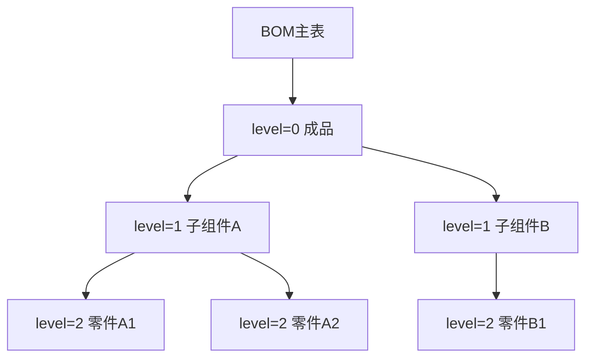

其中 `parent_detail_id` 指向父级明细行ID，形成自引用树形结构。

#### 4.4.4 状态枚举说明

**BOM状态（`BomStatus`）**

| 状态值 | 含义 | 可执行操作 |
|--------|------|-----------|
| `DRAFT` | 草稿 | 编辑、发布 |
| `PUBLISHED` | 已发布 | 创建生产任务、停产 |
| `DISCONTINUED` | 已停产 | 仅查看 |

**生产任务状态（`TaskStatus`）**

| 状态值 | 含义 | 可执行操作 |
|--------|------|-----------|
| `PENDING` | 待生产 | 开始生产 |
| `IN_PROGRESS` | 生产中 | 完成生产 |
| `COMPLETED` | 已完成 | 仅查看 |

**物料齐套状态（`MaterialAvailability`）**

| 状态值 | 含义 | 说明 |
|--------|------|------|
| `COMPLETE` | 齐套 | 所有物料库存充足 |
| `SHORTAGE` | 缺料 | 至少一种物料库存不足 |
| `FULFILLED` | 已齐套 | 物料已备齐，待生产 |

#### 4.4.5 关键字段说明

> 完整字段定义（类型、必填、默认值）详见《数据字典》→ **主线D：BOM与生产**。
>
> - **BOM主表** `bom_header`：`status` 为 `DRAFT` / `PUBLISHED` / `DISCONTINUED`
> - **BOM明细** `bom_detail`：`parent_detail_id` 自引用实现多级层级，`level` 标识层级（0/1/2）
> - **生产任务** `production_task`：`material_availability` 为 `COMPLETE` / `SHORTAGE` / `FULFILLED`

#### 4.4.6 物料齐套检查逻辑

创建生产任务时，系统自动执行物料齐套检查：

1. 根据BOM明细展开所有层级的物料需求
2. 计算每个物料的需求量 = `quantity_per_unit` × `plan_quantity` × (1 + `wastage_rate` / 100)
3. 查询每个物料在原材料仓（`RAW_MATERIAL`）的当前库存
4. 对比需求与库存：全部满足 → `COMPLETE`，任一不足 → `SHORTAGE`
5. 物料备齐后手动标记为 `FULFILLED`

#### 4.4.7 操作流程

**步骤1：创建BOM**

1. 进入BOM管理 → 点击 **新增BOM**
2. 填写BOM名称、版本号
3. 选择成品物料（`product_sku_id`）
4. 填写计划生产数量
5. 添加明细行：选择原材料物料、填写单台用量、损耗率、层级
6. 如需多级结构：设置 `level` 和 `parent_detail_id`
7. 点击 **保存** → BOM状态为 `DRAFT`
8. 确认无误 → 点击 **发布** → BOM状态变为 `PUBLISHED`

**步骤2：导入BOM（可选）**

1. 进入BOM管理 → 点击 **导入**
2. 下载Excel模板
3. 按模板格式填写：成品编码、原材料编码、单台用量、损耗率、层级
4. 上传文件 → 系统自动校验 → 导入成功
5. ⚠️ 物料编码必须已在系统中存在

**步骤3：创建生产任务**

1. 进入生产任务 → 点击 **新增任务**
2. 选择已发布的BOM
3. 填写计划生产数量
4. 选择产出类型（成品/半成品）
5. 设置计划开始/完成日期
6. 点击 **提交** → 系统自动执行物料齐套检查
7. 生成任务编号（PR前缀）

**步骤4：查看物料齐套状态**

1. 进入生产任务列表 → 查看 `material_availability` 列
2. `SHORTAGE` → 点击查看缺料明细，了解哪些物料不足
3. `COMPLETE` → 可开始生产
4. 物料备齐后 → 点击 **标记齐套** → 状态变为 `FULFILLED`

**步骤5：生产任务状态跟踪**

1. `PENDING` → 点击 **开始生产** → 状态变为 `IN_PROGRESS`
2. `IN_PROGRESS` → 点击 **完成生产** → 状态变为 `COMPLETED`
3. `COMPLETED` → 仅可查看

#### 4.4.8 注意事项

- ⚠️ BOM创建后默认为 `DRAFT` 状态，需手动发布才能用于生产任务
- ⚠️ BOM发布后不可编辑，如需修改需创建新版本
- ⚠️ BOM导入时，物料编码必须已在系统中存在，否则导入失败
- ⚠️ 物料齐套检查基于原材料仓（`RAW_MATERIAL`）的当前库存
- ⚠️ 损耗率以百分比存储，计算需求量时自动换算
- ⚠️ `parent_detail_id` 自引用实现多级层级，`level=0` 的行没有父级
- ⚠️ BOM停产后状态变为 `DISCONTINUED`，不可再用于创建生产任务
- ⚠️ 所有编辑操作均需填写变更原因，并写入审计日志

---


## 第5章 二期功能模块

二期（v2.x）在四条主线基础上新增了以下功能模块，完善了设备从出厂到安装、运维、盘点的全生命周期管理。

### 5.1 场站管理

#### 5.1.1 功能概述

场站管理维护客户场站的基础信息，是设备台账的前置依赖。核心角色为**管理员**（`ADMIN`）。

**业务场景**：管理员创建客户 → 创建场站 → 设备安装到场站 → 形成设备台账。

#### 5.1.2 核心数据表

| 表名 | 说明 | 关键字段 |
|------|------|----------|
| `customer` | 客户信息 | `name`、`contact_person`、`contact_phone`、`contract_no`、`contract_start`、`contract_end` |
| `station` | 场站档案 | `name`、`customer_id`、`address`、`status` |

#### 5.1.3 状态枚举说明

| 状态值 | 含义 | 可执行操作 |
|--------|------|-----------|
| `ACTIVE` | 启用 | 安装设备、编辑 |
| `INACTIVE` | 停用 | 仅查看 |

> 完整字段定义详见《数据字典》→ 附录 → `customer` / `station`。

#### 5.1.4 数据关系


- 客户 → 场站：一个客户可拥有多个场站
- 场站 → 设备台账：一个场站可安装多台设备

#### 5.1.5 注意事项

- ⚠️ 创建场站前必须先创建客户
- ⚠️ 场站停用后不可再安装新设备
- ⚠️ 客户信息包含合同编号、合同起止日期，用于合同管理和到期提醒

---

### 5.2 设备台账

#### 5.2.1 功能概述

设备台账记录每台设备安装到场站后的运行状态，是设备全生命周期追溯的最后一个环节。核心角色为**仓库管理员**（`WAREHOUSE`）和**管理员**（`ADMIN`）。

**业务场景**：设备出货 → 安装到场站 → 创建台账记录 → 跟踪运行状态 → 维护保养 → 回收/更换。

#### 5.2.2 核心数据表

| 表名 | 说明 | 关键字段 |
|------|------|----------|
| `device_ledger` | 设备台账 | `item_sn`（关联库存SN）、`station_id`、`installed_date`、`warranty_start`、`warranty_end`、`software_version`、`status` |

#### 5.2.3 状态枚举说明

| 状态值 | 含义 | 可执行操作 |
|--------|------|-----------|
| `RUNNING` | 运行中 | 记录故障、回收 |
| `FAULT` | 故障 | 维修、回收 |
| `RECOVERED` | 已回收 | 仅查看 |

> 完整字段定义详见《数据字典》→ 附录 → `device_ledger`。

#### 5.2.4 全生命周期追溯链

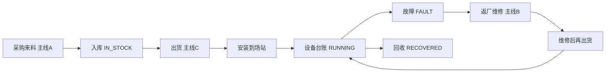

通过 `item_sn` 串联：**采购 → 入库 → 出货 → 安装 → 运行/故障 → 返厂维修 → 再出货 → 再安装**，实现设备从出厂到报废的全生命周期追溯。

#### 5.2.5 注意事项

- ⚠️ 创建设备台账时 `item_sn` 必须在库存中存在
- ⚠️ `removed_date` 为 NULL 表示设备当前仍在场站
- ⚠️ 质保期通过 `warranty_start` 和 `warranty_end` 管理，到期需关注
- ⚠️ 设备回收后状态变为 `RECOVERED`，记录移除日期

---

### 5.3 盘点管理

#### 5.3.1 功能概述

盘点管理支持周期盘点和全面盘点两种模式，通过扫码比对系统库存与实际库存，生成盘点差异报告。核心角色为**仓库管理员**（`WAREHOUSE`）和**管理员**（`ADMIN`）。

**业务场景**：创建盘点任务 → 扫码盘点 → 生成差异报告 → 差异处理（库存调整）。

#### 5.3.2 核心数据表

| 表名 | 说明 | 编号前缀 | 关键字段 |
|------|------|:---:|------|
| `stocktake` | 盘点任务 | PD | `stocktake_no`、`mode`、`status`、`warehouse` |
| `stocktake_line` | 盘点明细 | — | `item_sn`、`system_qty`、`actual_qty`、`diff_qty`、`diff_reason` |

#### 5.3.3 状态枚举说明

**盘点模式（`StocktakeMode`）**

| 模式值 | 含义 | 说明 |
|--------|------|------|
| `CYCLE` | 周期盘点 | 按仓库/分类分批盘点 |
| `FULL` | 全面盘点 | 全部库存一次性盘点 |

**盘点状态（`StocktakeStatus`）**

| 状态值 | 含义 | 可执行操作 |
|--------|------|-----------|
| `IN_PROGRESS` | 进行中 | 扫码盘点、完成盘点 |
| `COMPLETED` | 已完成 | 查看差异、生成调整单 |
| `CANCELLED` | 已取消 | 仅查看 |

#### 5.3.4 盘点流程

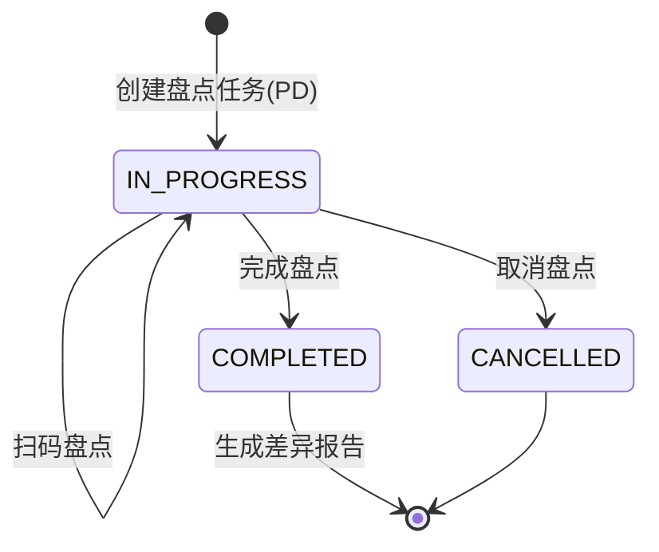

#### 5.3.5 注意事项

- ⚠️ 盘点进行中（`IN_PROGRESS`）时，相关仓库的出入库操作可能受限
- ⚠️ 盘点完成后系统自动计算差异数量（`diff_qty = actual_qty - system_qty`）
- ⚠️ 差异处理需通过库存调整模块生成调整单
- ⚠️ 所有盘点操作写入审计日志

---

### 5.4 库存调整

#### 5.4.1 功能概述

库存调整用于处理盘点差异、状态变更等需要调整库存数据的场景。调整单关联盘点明细，确保每笔调整都有据可查。核心角色为**仓库管理员**（`WAREHOUSE`）和**管理员**（`ADMIN`）。

#### 5.4.2 核心数据表

| 表名 | 说明 | 编号前缀 | 关键字段 |
|------|------|:---:|------|
| `inventory_adjustment` | 库存调整单 | TZ | `adjustment_no`、`stocktake_id`、`stocktake_line_id`、`item_sn`、`adjustment_type`、`before_status`、`after_status`、`reason` |

#### 5.4.3 状态枚举说明

| 调整类型 | 代码 | 含义 |
|----------|------|------|
| 盘盈 | `SURPLUS` | 实际库存多于系统库存 |
| 盘亏 | `SHORTAGE` | 实际库存少于系统库存 |

> 完整字段定义详见《数据字典》→ 附录 → `inventory_adjustment`。

#### 5.4.4 注意事项

- ⚠️ 每笔调整必须关联盘点明细行（`stocktake_line_id`），确保可追溯
- ⚠️ 调整类型 `SURPLUS`（盘盈）/ `SHORTAGE`（盘亏）由差异数量决定
- ⚠️ 调整前后库存状态（`before_status` / `after_status`）必须记录
- ⚠️ 调整原因（`reason`）必填，写入审计日志

---

### 5.5 客户管理扩展

#### 5.5.1 功能概述

二期对客户管理（`customer` 表）进行了增强，新增了 8 个扩展字段，支持合同管理、权重排序等功能。核心角色为**管理员**（`ADMIN`）。

#### 5.5.2 新增字段

| 字段 | 类型 | 说明 |
|------|------|------|
| `weight` | Integer | 客户权重，数值越高排序越靠前 |
| `contact_email` | String(100) | 联系邮箱 |
| `address` | Text | 客户地址 |
| `contract_no` | String(50) | 合同编号 |
| `contract_start` | Date | 合同起始日期 |
| `contract_end` | Date | 合同到期日期 |
| `remark` | Text | 备注 |

> 完整字段定义详见《数据字典》→ 附录 → `customer`。

#### 5.5.3 注意事项

- ⚠️ 客户名称全局唯一，重复则拒绝提交
- ⚠️ 客户被场站引用后不可删除
- ⚠️ 合同到期日期可用于到期提醒

---

### 5.6 数据看板

#### 5.6.1 功能概述

数据看板提供关键业务指标的可视化展示，帮助管理层快速了解系统运行状态。面向**所有角色**开放。

#### 5.6.2 统计维度

| 统计项 | 说明 | 图表类型 |
|--------|------|----------|
| 库存总览 | 按仓库类型统计库存数量分布 | 饼图 |
| 出货趋势 | 按时间统计出货量变化 | 折线图 |
| 返厂统计 | 按状态统计返厂单分布 | 柱状图 |
| 待办事项 | 各模块待处理数量汇总 | 数字卡片 |
| 物料消耗 | 按SKU统计出入库频次 | 排行榜 |

#### 5.6.3 注意事项

- ⚠️ 数据看板为只读视图，不提供编辑功能
- ⚠️ 数据刷新依赖后端 API，默认不自动轮询

---

### 5.7 轮询提醒

#### 5.7.1 功能概述

轮询提醒功能在前端界面顶部导航栏显示**铃铛图标**，实时提示用户有待处理的业务单据。面向**所有角色**。

#### 5.7.2 提醒类型

| 提醒项 | 触发条件 | 目标角色 |
|--------|----------|----------|
| 待检验 | 到货单 `PENDING_INSPECTION` | QUALITY |
| 待诊断 | 返厂单 `PENDING_DIAGNOSIS` | TEST_ENGINEER |
| 待审批 | 报废单 `PENDING` | ADMIN |
| 待入库 | 到货单 `ACCEPTED` / 返厂单 `QUALITY_CHECK` | WAREHOUSE |
| 待质检 | 返厂单 `REPAIRED` | QUALITY |

#### 5.7.3 注意事项

- ⚠️ 轮询间隔默认 30 秒，由前端控制
- ⚠️ 点击铃铛图标可展开待办列表
- ⚠️ 点击待办项直接跳转到对应处理页面

---

## 第6章 支撑模块

支撑模块是四条业务线共用的基础功能，不绑定特定业务线，但为所有业务线提供数据底座和操作入口。

### 5.1 入库管理

#### 5.1.1 模块概述

入库管理负责所有物料入库操作，包括采购入库和非采购入库。核心角色为**仓库管理员**（`WAREHOUSE`）。

#### 5.1.2 入库类型

| 入库类型 | 说明 | 来源 |
|----------|------|------|
| 采购入库 | 主线A来料检验合格后入库 | 到货单 → 入库 |
| 维修入库 | 主线B维修完成后入库 | 返厂维修 → 零成本仓入库 |
| 生产入库 | 主线D生产完成后入库 | 生产任务 → 成品仓入库 |
| 非采购入库 | 其他来源入库（如盘点、调拨） | 手动创建 |

#### 5.1.3 入库流程

1. 创建入库单（JIN前缀编号）
2. 填写入库物料、数量、仓库类型
3. 录入SN（一物一码）
4. 提交审核
5. 审核通过 → 库存更新

#### 5.1.4 仓库类型与入库对照

| 仓库类型 | 代码 | 入库来源 | 说明 |
|----------|------|----------|------|
| 原材料仓 | `RAW_MATERIAL` | 主线A采购入库 | 正常原材料库存 |
| 半成品仓 | `SEMI_FINISHED` | 主线D生产入库 | 自制半成品 |
| 成品仓 | `FINISHED` | 主线D生产入库 | 正常成品库存 |
| 零成本仓-成品 | `ZERO_COST_FINISHED` | 主线B维修入库 | 不计入库存成本 |
| 零成本仓-半成品 | `ZERO_COST_SEMI` | 主线B维修入库 | 不计入库存成本 |
| 研发物料仓 | `RND` | 研发领用后归还 | 研发专用物料 |

### 5.2 出库管理

#### 5.2.1 模块概述

出库管理负责所有物料出库操作，支持11种出库类型，每种类型对应11种退回类型，形成对称的出库-退回体系。

#### 5.2.2 11种出库类型与对称退回

| 出库类型 | 代码 | 使用场景 | 对应退回类型 |
|----------|------|----------|-------------|
| 售出-线上 | `SOLD` | 正常销售发货 | `RETURNED_FROM_SALE` |
| 售出-线下 | `SOLD_OFFLINE` | 线下门店销售 | `RETURNED_FROM_SOLD_OFFLINE` |
| 准售出 | `PRESOLD` | 预售/待确认销售 | `RETURNED_FROM_PRESOLD` |
| 赠送 | `GIFTED` | 免费赠送 | `RETURNED_FROM_GIFT` |
| 报废 | `SCRAPPED` | 设备报废处理 | `RETURNED_FROM_SCRAPPED` |
| 研发 | `RND` | 研发领用 | `RETURNED_FROM_RND` |
| 样机 | `SAMPLE` | 样机展示 | `RETURNED_FROM_SAMPLE` |
| 试用 | `TRIAL` | 客户试用 | `RETURNED_FROM_TRIAL` |
| 维修 | `REPAIR` | 维修领用 | `RETURNED_FROM_REPAIR` |
| 部门采购 | `DEPT_PROCUREMENT` | 内部部门采购 | `RETURNED_FROM_DEPT_PROCUREMENT` |
| 借用 | `BORROWED` | 临时借用 | `RETURNED_FROM_BORROW` |

#### 5.2.3 出库流程

1. 创建出库单（JOUT前缀编号）
2. 选择出库类型
3. 选择出库物料、填写数量
4. 录入SN（一物一码）
5. 提交审核
6. 审核通过 → 库存扣减

### 5.3 库存管理（一物一码）

#### 5.3.1 核心概念

IMS 库存管理以**一物一码**（每个设备一个唯一SN）为基础，实现单品的全生命周期追踪。每条库存记录对应一个 `item_sn`，记录该设备的当前位置、状态、仓库类型。

#### 5.3.2 库存状态

| 状态 | 代码 | 说明 |
|------|------|------|
| 在库 | `IN_STOCK` | 设备在仓库中，可出库 |
| 已售出 | `SOLD` | 设备已销售出库 |
| 已报废 | `SCRAPPED` | 设备已报废 |
| 已替换 | `REPLACED` | 设备SN被替换（维修换码） |
| 维修中 | `REPAIRING` | 设备在维修流程中 |
| 返厂中 | `RETURNED` | 设备已返厂 |

#### 5.3.3 库存单品生命周期

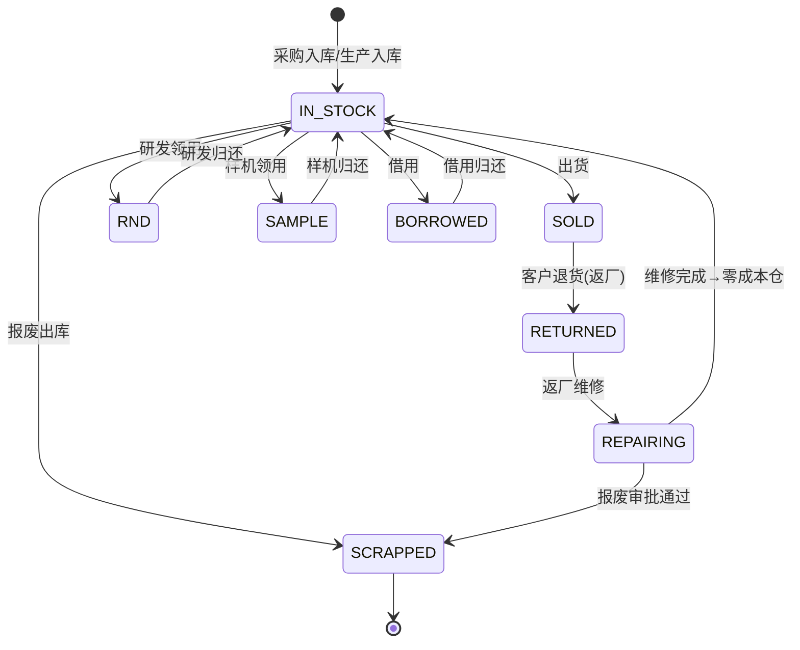

#### 5.3.4 库存查询

- 支持按SN、SKU、仓库类型、状态多维度查询
- 支持单品变动轨迹查看（完整流转履历）
- 支持库存快照（按时间点查看库存状态）
- 支持库存流水（按时间线查看所有变动）

### 5.4 商品SKU管理

#### 5.4.1 模块概述

商品SKU管理维护系统中的物料基础数据，包括成品、半成品、原材料。所有SKU可被四条业务线引用。

#### 5.4.2 关键字段

| 字段 | 说明 |
|------|------|
| `sku_code` | 物料编码（U9编码），唯一标识 |
| `sku_name` | 物料名称 |
| `spec` | 规格型号 |
| `unit` | 单位 |
| `category` | 分类（成品/半成品/原材料） |
| `supplier_id` | 默认供应商 |

#### 5.4.3 管理功能

- 新增/编辑/删除SKU
- 批量导入（Excel）
- 批量导出
- 按分类筛选

### 5.5 往来单位管理

#### 5.5.1 模块概述

往来单位管理维护供应商、客户、物流商等外部单位信息。采购、出货、退货等业务操作均需关联往来单位。

#### 5.5.2 单位类型

| 类型 | 说明 | 关联业务 |
|------|------|----------|
| 供应商 | 原材料/物料供应商 | 主线A采购 |
| 客户 | 产品购买方 | 主线C出货、主线B退货 |
| 物流商 | 快递/物流公司 | 主线C出货 |

#### 5.5.3 关键字段

| 字段 | 说明 |
|------|------|
| `partner_name` | 单位名称 |
| `partner_type` | 单位类型 |
| `contact_person` | 联系人 |
| `contact_phone` | 联系电话 |
| `address` | 地址 |

### 5.6 仪表盘

#### 5.6.1 模块概述

仪表盘为各角色提供工作台视图，包含待办事项、关键指标、数据概览。

#### 5.6.2 统计维度

| 统计项 | 说明 | 可见角色 |
|--------|------|----------|
| 待审核统计 | 各模块待处理数量 | 所有角色 |
| 库存统计（按SKU汇总） | 各SKU在库数量 | 所有角色 |
| 往来单位出库统计 | 按客户统计出货量 | 所有角色 |
| 返厂维修统计 | 返厂单各状态数量 | QUALITY, ADMIN |
| 生产任务统计 | 任务状态分布 | PRODUCTION, ADMIN |

### 5.7 打印功能

#### 5.7.1 模块概述

系统支持6种标准打印模板，覆盖所有核心单据。

#### 5.7.2 打印模板

| 模板名称 | 对应单据 | 打印入口 |
|----------|----------|----------|
| 到货单打印 | 来料到货单 | 来料管理 → 到货单详情 |
| 来料检验报告打印 | 来料检验报告 | 来料管理 → 检验详情 |
| 原材料退货单打印 | 来料退货单 | 来料管理 → 退货单详情 |
| 出货单打印 | 出货单 | 出货管理 → 出货单详情 |
| 维修工单打印 | 维修工单 | 返厂维修 → 维修详情 |
| BOM打印 | BOM表 | BOM管理 → BOM详情 |

#### 5.7.3 打印流程

1. 进入对应单据详情页
2. 点击 **打印** 按钮
3. 预览打印内容
4. 选择打印机 → 打印 或 另存为PDF

### 5.8 审计日志

#### 5.8.1 模块概述

审计日志自动记录所有数据变更操作，包括创建、修改、删除、状态变更。是系统安全追溯的核心机制。

#### 5.8.2 记录内容

| 字段 | 说明 |
|------|------|
| `entity_type` | 实体类型（如 `incoming_receipt`） |
| `entity_no` | 实体编号（如 `RC20260901001`） |
| `action` | 操作类型：`CREATE` / `UPDATE` / `DELETE` / `STATUS_CHANGE` |
| `operator_id` | 操作人 |
| `changes` | 变更内容（JSON格式，记录旧值→新值） |
| `change_reason` | 变更原因 |
| `created_at` | 操作时间 |
| `ip_address` | 操作IP地址 |

#### 5.8.3 查询与筛选

- 按实体类型、实体编号、操作人、时间范围筛选
- 按操作类型筛选
- 支持导出审计日志

#### 5.8.4 安全要求

- ⚠️ 审计日志仅 `ADMIN` 角色可查看
- ⚠️ 审计日志不可删除、不可修改
- ⚠️ 所有状态变更操作必须填写变更原因
- ⚠️ 审计日志定期归档，保留周期可配置

---

## 第7章 核心业务规则

### 6.1 核心状态机

#### 6.1.1 四条主线状态流转

系统共有四条核心业务线，各线状态机如下：

**主线A（采购来料管理）**

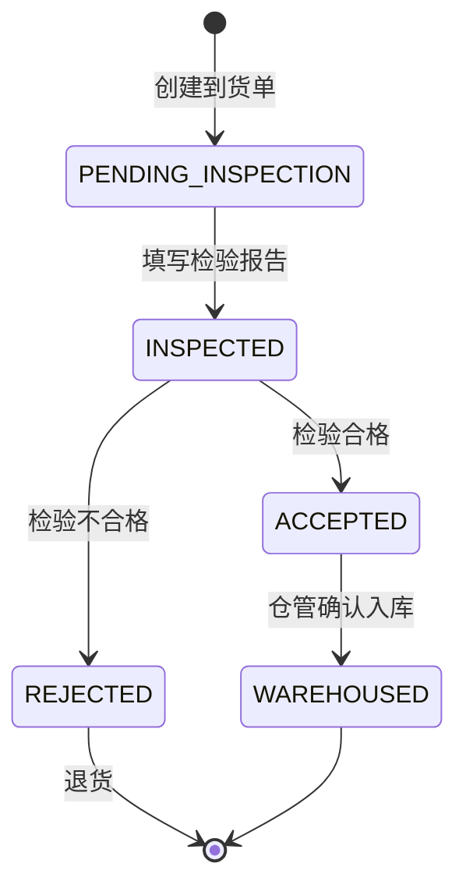

**主线B（成品返厂维修）**

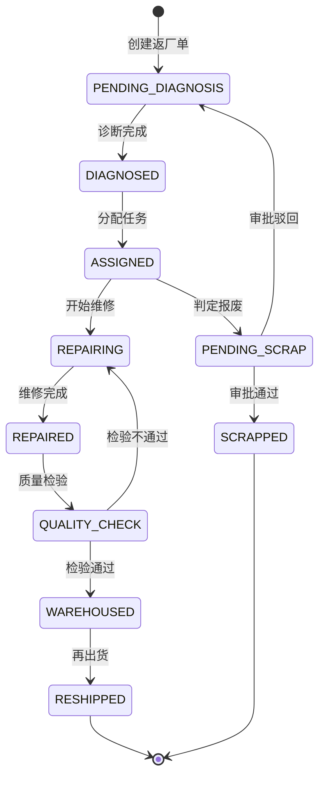

**主线C（出货管理）**

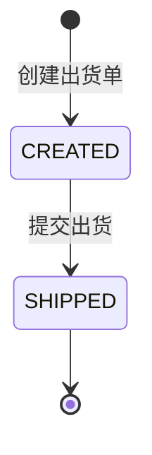

**主线D（BOM与生产准备）**

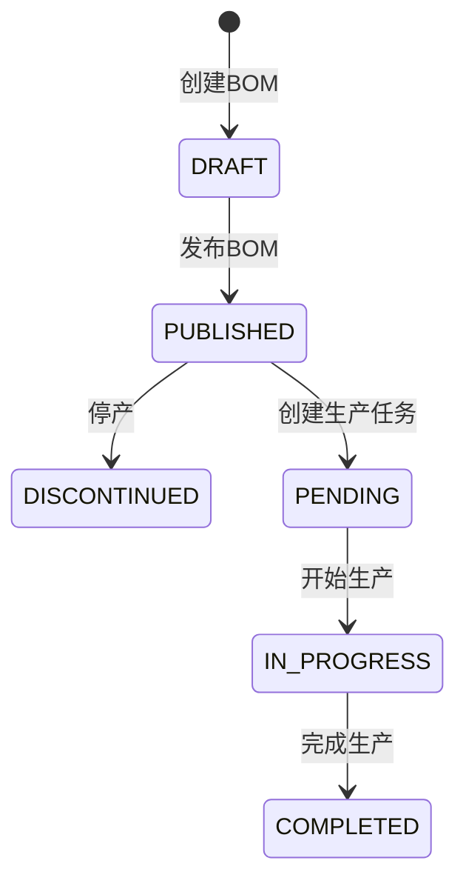

#### 6.1.2 库存单品生命周期

每个库存单品（以SN标识）经历以下生命周期：


### 6.2 SN唯一性与新旧替换规则

#### 6.2.1 SN唯一性

- 每个SN在系统中全局唯一，同一SN不允许复用
- SN创建时系统自动校验唯一性
- SN格式由企业自定义，系统不做强制格式校验

#### 6.2.2 新旧SN替换机制

当维修需要更换设备SN时：

1. **旧SN**：状态变为 `REPLACED`，记录 `replaced_by_sn` 指向新SN，生命周期结束
2. **新SN**：创建新库存记录，记录 `replaced_from_sn` 指向旧SN，进入零成本仓
3. **维修工单**：记录 `old_sn` → `new_sn` 的映射关系
4. **追溯**：通过新旧SN的关联关系，可追溯设备的完整维修历史

#### 6.2.3 换码校验规则

- ⚠️ 新SN必须全局唯一，与已有SN重复时拒绝提交
- ⚠️ 旧SN必须处于维修流程中（`REPAIRING` 状态）
- ⚠️ 换码操作不可逆，提交后旧SN永久标记为 `REPLACED`

### 6.3 11种出库与11种退回的对称规则

系统设计了一套对称的出库-退回体系，确保每种出库类型都有对应的退回类型，形成完整的库存流转闭环。

| 出库类型 | 退回类型 | 使用场景 |
|----------|----------|----------|
| `SOLD` | `RETURNED_FROM_SALE` | 售出后退回（返厂维修） |
| `SOLD_OFFLINE` | `RETURNED_FROM_SOLD_OFFLINE` | 线下售出后退回 |
| `PRESOLD` | `RETURNED_FROM_PRESOLD` | 预售取消退回 |
| `GIFTED` | `RETURNED_FROM_GIFT` | 赠送退回 |
| `SCRAPPED` | `RETURNED_FROM_SCRAPPED` | 报废撤销（需审批） |
| `RND` | `RETURNED_FROM_RND` | 研发归还 |
| `SAMPLE` | `RETURNED_FROM_SAMPLE` | 样机归还 |
| `TRIAL` | `RETURNED_FROM_TRIAL` | 试用归还 |
| `REPAIR` | `RETURNED_FROM_REPAIR` | 维修归还 |
| `DEPT_PROCUREMENT` | `RETURNED_FROM_DEPT_PROCUREMENT` | 部门采购退货 |
| `BORROWED` | `RETURNED_FROM_BORROW` | 借用归还 |

**规则说明**：
- 退回时必须选择对应的退回类型，不可混用
- 退回类型与出库类型一一对应，确保库存流转可追溯
- 退回入库时系统自动匹配原出库类型

### 6.4 零成本仓管理规则

#### 6.4.1 零成本仓定义

零成本仓是维修完成后存放修复设备的专用仓库，在财务核算上不计入库存成本。

| 仓库类型 | 代码 | 用途 |
|----------|------|------|
| 零成本仓-成品 | `ZERO_COST_FINISHED` | 维修完成的成品 |
| 零成本仓-半成品 | `ZERO_COST_SEMI` | 维修完成的半成品 |

#### 6.4.2 入库规则

- 维修完成后的设备**必须**入库到零成本仓，而非普通成品仓
- 入库时记录该SN的累计维修次数（`repair_count`）
- 入库时汇总该SN的维修原因（`repair_reason`）

#### 6.4.3 与普通仓的差异

| 对比维度 | 普通成品仓（`FINISHED`） | 零成本仓（`ZERO_COST_FINISHED`） |
|----------|:---:|:---:|
| 入库来源 | 采购入库、生产入库 | 维修完成入库 |
| 财务核算 | 计入库存成本 | 不计入库存成本 |
| 出库方式 | 正常销售出库 | 再出货（RH） |
| 成本属性 | 有成本 | 零成本 |

### 6.5 物料齐套判断规则

#### 6.5.1 齐套检查流程

创建生产任务时，系统自动执行物料齐套检查：

1. 根据BOM明细展开所有层级的物料需求
2. 计算每个物料的需求量：`需求量 = 单台用量 × 计划生产数量 × (1 + 损耗率/100)`
3. 查询每个物料在原材料仓（`RAW_MATERIAL`）的当前库存
4. 对比需求与库存
5. 全部满足 → `COMPLETE`（齐套），任一不足 → `SHORTAGE`（缺料）

#### 6.5.2 齐套状态

| 状态 | 代码 | 含义 | 后续操作 |
|------|------|------|----------|
| 齐套 | `COMPLETE` | 所有物料库存充足 | 可开始生产 |
| 缺料 | `SHORTAGE` | 至少一种物料不足 | 查看缺料明细，安排采购 |
| 已齐套 | `FULFILLED` | 物料已备齐 | 待生产 |

#### 6.5.3 注意事项

- ⚠️ 齐套检查仅基于原材料仓（`RAW_MATERIAL`）库存
- ⚠️ 损耗率以百分比存储，计算时自动换算为小数
- ⚠️ 多级BOM需逐层展开后汇总物料需求

### 6.6 单据编号生成规则

所有单据编号遵循统一格式：`前缀 + 日期8位 + 流水号3位`，如 `RC20260910001`。

| 前缀 | 含义 | 示例 |
|:---:|------|------|
| RC | 到货单 | RC20260910001 |
| FC | 返厂单 | FC20260910001 |
| SH | 出货单 | SH20260910001 |
| BF | 报废单 | BF20260910001 |
| WX | 维修工单 | WX20260910001 |
| DG | 诊断报告 | DG20260910001 |
| RH | 再出货单 | RH20260910001 |
| JIN | 入库单 | JIN20260910001 |
| JOUT | 出库单 | JOUT20260910001 |
| BOM | BOM编号 | BOM20260910001 |
| PR | 生产任务 | PR20260910001 |

**生成规则**：
- 前缀固定，由系统生成时自动添加
- 日期取当天日期（YYYYMMDD）
- 流水号从001开始，同一天同前缀自增
- 编号全局唯一，系统自动校验

### 6.7 异常处理流程

#### 6.7.1 常见异常场景

| 异常场景 | 处理方式 | 操作角色 |
|----------|----------|----------|
| 检验不合格 | 生成退货单，退回供应商 | WAREHOUSE |
| 维修质量不通过 | 退回 `REPAIRING` 状态，重新维修 | QUALITY |
| 报废审批驳回 | 退回 `PENDING_DIAGNOSIS` 状态 | ADMIN |
| 物料缺料 | 标记 `SHORTAGE`，等待采购 | PRODUCTION |
| SN重复 | 系统拒绝提交，提示更换新SN | — |
| 入库数量超限 | 系统自动校验，拒绝入库 | — |

#### 6.7.2 异常处理原则

- ⚠️ 所有异常操作必须填写变更原因（`change_reason`）
- ⚠️ 异常操作写入审计日志
- ⚠️ 关键异常（报废、退货）需审批后才能执行
- ⚠️ 状态回退需有明确的回退路径，不可跨状态跳跃

---

## 第8章 角色与权限

### 7.1 6种角色定义

| 角色 | 代码 | 职责概述 |
|------|------|----------|
| 管理员/总经理 | `ADMIN` | 全局管理、审批报废、用户管理、系统设置 |
| 仓库管理员 | `WAREHOUSE` | 入库/出库操作、来料管理、出货管理、RMA入库确认 |
| 来料检/质量负责人 | `QUALITY` | 来料检验、返厂诊断与分配、维修质量检验 |
| 生产主管 | `PRODUCTION` | BOM管理、生产任务、物料齐套检查 |
| 测试工程师 | `TEST_ENGINEER` | 返厂设备诊断、功能维修 |
| 普通员工 | `STAFF` | 仅查看库存/SKU/往来单位/流程 |

### 7.2 完整权限矩阵

| 功能模块 | ADMIN | WAREHOUSE | QUALITY | PRODUCTION | TEST_ENGINEER | STAFF | 后端限制 | 安全等级 |
|----------|:---:|:---:|:---:|:---:|:---:|:---:|------|:---:|
| 仪表盘 | ✅ | ✅ | ✅ | ✅ | ✅ | ✅ | `get_current_user` | 🟢 一致 |
| 库存查询 | ✅ | ✅ | ✅ | ✅ | ✅ | ✅ | `get_current_user` | 🟢 一致 |
| 库存快照 | ✅ | ✅ | ✅ | ✅ | ✅ | ✅ | `get_current_user` | 🟢 一致 |
| 商品SKU | ✅ | ✅ | ✅ | ✅ | ✅ | ✅ | `get_current_user` | 🟢 一致 |
| 往来单位 | ✅ | ✅ | ✅ | ✅ | ✅ | ✅ | `get_current_user` | 🟢 一致 |
| 业务流程 | ✅ | ✅ | ✅ | ✅ | ✅ | ✅ | 无API（纯前端） | 🟢 一致 |
| **入库管理** | ✅ | ✅ | ❌ | ❌ | ❌ | ❌ | `get_current_user` | 🔴 仅前端限制 |
| **出库管理** | ✅ | ✅ | ❌ | ❌ | ❌ | ❌ | `get_current_user` | 🔴 仅前端限制 |
| **来料管理** | ✅ | ✅ | ✅ | ❌ | ❌ | ❌ | `get_current_user` | 🔴 仅前端限制 |
| **返厂维修** | ✅ | ✅ | ✅ | ✅ | ✅ | ❌ | `get_current_user` | 🔴 仅前端限制 |
| **出货管理** | ✅ | ✅ | ✅ | ✅ | ❌ | ❌ | `get_current_user` | 🔴 仅前端限制 |
| BOM查看 | ✅ | ✅ | ❌ | ✅ | ❌ | ❌ | `get_current_user` | 🟡 仅前端限制 |
| **BOM编辑** | ✅ | ✅ | ❌ | ✅ | ❌ | ❌ | `BOM_EDIT_ROLES` | 🟢 双重保障 |
| **生产任务编辑** | ✅ | ✅ | ❌ | ✅ | ❌ | ❌ | `BOM_EDIT_ROLES` | 🟢 双重保障 |
| 打印 | 按模块继承 | 按模块继承 | 按模块继承 | 按模块继承 | 按模块继承 | 按模块继承 | `get_current_user` | 🟡 继承模块限制 |
| **用户管理** | ✅ | ❌ | ❌ | ❌ | ❌ | ❌ | `get_current_admin` | 🟢 双重保障 |
| **系统设置** | ✅ | ❌ | ❌ | ❌ | ❌ | ❌ | `get_current_admin` | 🟢 双重保障 |
| **审计日志** | ✅ | ❌ | ❌ | ❌ | ❌ | ❌ | `get_current_admin` | 🟢 双重保障 |

> **安全标注说明**：
> - 🟢 双重保障：前端路由 + 后端依赖注入双重校验
> - 🟡 仅前端限制：后端仅验证登录，实际权限依赖前端路由守卫
> - 🔴 仅前端限制：核心业务模块，后端未做角色校验，已知风险，建议后续加固

### 7.3 权限控制机制

#### 7.3.1 双重保障机制

系统权限控制采用**前端路由守卫 + 后端依赖注入**的双重保障。

| 层级 | 实现方式 | 说明 |
|------|----------|------|
| 前端 | Vue Router + `meta.roles` | 控制菜单显示和路由访问 |
| 后端 | FastAPI `Depends(get_current_admin)` / `Depends(get_current_user)` | 控制API接口访问 |

#### 7.3.2 后端权限依赖

| 依赖函数 | 验证级别 | 适用角色 |
|----------|----------|----------|
| `get_current_user` | 仅验证登录 | 所有角色 |
| `get_current_admin` | 验证登录 + 角色为 `ADMIN` | 仅 ADMIN |
| `BOM_EDIT_ROLES` | 验证角色在 `[ADMIN, WAREHOUSE, PRODUCTION]` 中 | BOM/生产编辑 |

#### 7.3.3 安全等级说明

| 等级 | 图标 | 含义 | 示例 |
|:---:|:---:|------|------|
| 双重保障 | 🟢 | 前端路由 + 后端依赖注入双重校验 | 用户管理、系统设置、审计日志 |
| 仅前端限制 | 🟡 | 后端仅验证登录，实际权限依赖前端路由守卫 | BOM查看 |
| 仅前端限制 | 🔴 | 核心业务模块，后端未做角色校验，已知风险 | 入库管理、出库管理、来料管理 |

### 7.4 安全建议

1. 🔴 **高优先级**：入库管理、出库管理、来料管理、返厂维修、出货管理后端应增加角色校验
2. 🟡 **中优先级**：BOM查看后端应增加角色校验
3. 🟢 **已达标**：用户管理、系统设置、审计日志、BOM编辑、生产任务编辑已双重保障

---

## 第9章 数据规范与编码规则

### 8.1 单据编号规则

| 前缀 | 含义 | 格式示例 | 生成位置 |
|------|------|----------|----------|
| `RC` | 到货单 | RC20260910001 | 来料到货单 |
| `FC` | 返厂单 | FC20260910001 | 返厂退货单 |
| `SH` | 出货单 | SH20260910001 | 出货单 |
| `BF` | 报废单 | BF20260910001 | 报废审批单 |
| `WX` | 维修工单 | WX20260910001 | 维修工单 |
| `DG` | 诊断报告 | DG20260910001 | 诊断报告 |
| `RH` | 再出货单 | RH20260910001 | 再出货单 |
| `JIN` | 入库单 | JIN20260910001 | 入库单 |
| `JOUT` | 出库单 | JOUT20260910001 | 出库单 |
| `BOM` | BOM编号 | BOM20260910001 | BOM主表 |
| `PR` | 生产任务 | PR20260910001 | 生产任务 |

### 8.2 SN编码规则

SN为企业自定义格式，系统不做强制格式校验。建议遵循以下规范：

- 在SN中编码产品型号、生产日期、流水号等信息
- 确保全局唯一，系统自动校验
- 维修换码后的新SN建议与原SN保持关联关系（系统自动记录）

### 8.3 物料编码规则

物料编码（`sku_code`）建议与U9系统保持一致，便于系统对接。

### 8.4 状态枚举速查表

#### 主线A：到货单状态（`IncomingStatus`）

| 状态值 | 代码 | 含义 |
|--------|------|------|
| 待检验 | `PENDING_INSPECTION` | 到货单已创建，等待检验 |
| 已检验 | `INSPECTED` | 检验报告已提交 |
| 合格入库 | `ACCEPTED` | 检验合格，等待入库确认 |
| 不合格退货 | `REJECTED` | 检验不合格，等待退货 |
| 已入库 | `WAREHOUSED` | 入库确认完成 |

#### 主线B：返厂单状态（`RmaStatus`）

| 状态值 | 代码 | 含义 |
|--------|------|------|
| 待诊断 | `PENDING_DIAGNOSIS` | 返厂单已创建，等待诊断 |
| 已诊断 | `DIAGNOSED` | 诊断报告已提交 |
| 已分配 | `ASSIGNED` | 任务已分配 |
| 维修中 | `REPAIRING` | 正在维修 |
| 已修复 | `REPAIRED` | 维修完成，等待质检 |
| 质量检验 | `QUALITY_CHECK` | 质检中 |
| 已入库 | `WAREHOUSED` | 维修完成入库 |
| 已再出货 | `RESHIPPED` | 再出货完成 |
| 已报废 | `SCRAPPED` | 报废审批通过 |
| 待报废审批 | `PENDING_SCRAP` | 等待总经理审批 |

#### 主线D：BOM状态与生产任务状态

| 枚举 | 状态值 | 代码 | 含义 |
|------|--------|------|------|
| BomStatus | 草稿 | `DRAFT` | 可编辑 |
| BomStatus | 已发布 | `PUBLISHED` | 可创建生产任务 |
| BomStatus | 已停产 | `DISCONTINUED` | 仅查看 |
| TaskStatus | 待生产 | `PENDING` | 等待开始 |
| TaskStatus | 生产中 | `IN_PROGRESS` | 正在生产 |
| TaskStatus | 已完成 | `COMPLETED` | 生产完成 |
| MaterialAvailability | 齐套 | `COMPLETE` | 物料充足 |
| MaterialAvailability | 缺料 | `SHORTAGE` | 物料不足 |
| MaterialAvailability | 已齐套 | `FULFILLED` | 物料已备齐 |

#### 库存状态（`StockStatus`）

| 状态值 | 代码 | 含义 |
|--------|------|------|
| 在库 | `IN_STOCK` | 可出库 |
| 已售出 | `SOLD` | 已销售 |
| 已报废 | `SCRAPPED` | 已报废 |
| 已替换 | `REPLACED` | SN被替换 |
| 研发中 | `RND` | 研发领用 |
| 样机 | `SAMPLE` | 样机展示 |
| 借用 | `BORROWED` | 临时借用 |
| 返厂 | `RETURNED` | 客户退货 |
| 维修中 | `REPAIRING` | 返厂维修 |
| 维修中 | `IN_REPAIR` | 维修领用中 |

#### 仓库类型（`WarehouseType`）

| 状态值 | 代码 | 含义 |
|--------|------|------|
| 原材料仓 | `RAW_MATERIAL` | 采购原材料 |
| 半成品仓 | `SEMI_FINISHED` | 自制半成品 |
| 成品仓 | `FINISHED` | 正常成品 |
| 零成本仓-成品 | `ZERO_COST_FINISHED` | 维修成品 |
| 零成本仓-半成品 | `ZERO_COST_SEMI` | 维修半成品 |
| 研发物料仓 | `RND` | 研发专用 |

---

## 第10章 系统集成说明

### 9.1 U9系统对接预留

系统预留了U9 ERP系统对接字段：

| 字段 | 所在表 | 说明 |
|------|--------|------|
| `sku_code` | `product_sku` | 物料编码（U9编码） |
| `u9_task_no` | `shipment` | U9任务单号 |

**对接方式**：通过API接口或数据库视图实现数据同步，具体对接方案需根据U9版本确定。

### 9.2 扫码设备集成

系统支持扫码枪输入，所有SN输入框均可通过扫码枪扫码录入。

**接入方式**：
- 扫码枪通过USB连接，模拟键盘输入
- 浏览器扫码：通过Web API调用摄像头
- 支持批量SN扫描（换行符分隔）

### 9.3 定时任务

系统支持以下定时任务（可配置）：

| 任务 | 说明 | 建议频率 |
|------|------|----------|
| 审计日志归档 | 将历史审计日志导出归档 | 每月 |
| 库存报表生成 | 自动生成库存日报 | 每日 |
| 数据备份 | 数据库自动备份 | 每日 |

---

## 第11章 系统维护与安全

### 10.1 用户与权限管理

- 用户管理：仅 `ADMIN` 角色可新增/编辑/删除用户
- 角色分配：每个用户对应一个角色，权限由角色决定
- 密码策略：建议定期更换密码，首次登录强制修改

### 10.2 数据备份与恢复

- **备份方式**：MySQL 定时备份（mysqldump）
- **备份频率**：建议每日全量备份
- **恢复流程**：停止服务 → 恢复数据库 → 重启服务
- ⚠️ 备份文件需存储在安全位置，定期验证可恢复性

### 10.3 日志查看

- **应用日志**：Docker 容器日志，通过 `docker logs` 查看
- **审计日志**：系统内置审计日志模块，仅 `ADMIN` 可查看
- **错误日志**：FastAPI 自动记录，包含请求ID、错误堆栈

### 10.4 安全注意事项

- ⚠️ 生产环境必须修改默认密码
- ⚠️ 数据库密码通过环境变量或 `.env` 文件配置，不硬编码
- ⚠️ API 接口需通过 JWT Token 认证
- ⚠️ 审计日志不可删除，确保操作可追溯
- ⚠️ 定期检查用户权限，停用不再使用的账号
- ⚠️ 敏感操作（报废、退货）需审批

### 10.5 故障排查指南

| 故障现象 | 可能原因 | 排查步骤 |
|----------|----------|----------|
| 无法登录 | 密码错误/账号停用 | 1. 检查密码 2. 联系管理员 |
| 页面加载失败 | 服务未启动 | 1. `docker compose ps` 检查状态 2. 查看日志 |
| API返回500 | 后端异常 | 1. 查看 `docker logs` 2. 检查数据库连接 |
| 数据不显示 | 权限不足 | 1. 检查当前角色 2. 确认功能权限 |
| SN重复校验失败 | 新SN已存在 | 1. 在库存中搜索SN 2. 更换新SN |

---

## 附录

### 附录A 术语表

| 术语 | 全称 | 说明 |
|------|------|------|
| SN | Serial Number | 设备序列号，一物一码的核心标识 |
| SKU | Stock Keeping Unit | 库存单位，即物料编码 |
| BOM | Bill of Materials | 物料清单 |
| RMA | Return Material Authorization | 退料授权，即返厂维修管理 |
| JWT | JSON Web Token | 用户认证令牌 |
| API | Application Programming Interface | 应用程序接口 |
| SPA | Single Page Application | 单页应用 |
| ORM | Object Relational Mapping | 对象关系映射 |

### 附录B 核心数据字典

完整数据字典已独立为单独文档，由 `backend/scripts/generate_data_dict.py` 从 SQLAlchemy Model 自动生成，与代码保持100%一致。

> 📄 **详见**：[《数据字典》](../附录/数据字典.md)
>
> 更新命令：`cd backend && python scripts/generate_data_dict.py`

### 附录C 错误代码表

| 错误码 | HTTP状态码 | 说明 |
|--------|:---:|------|
| 400 | 400 | 请求参数错误 |
| 401 | 401 | 未登录或Token过期 |
| 403 | 403 | 权限不足 |
| 404 | 404 | 资源不存在 |
| 409 | 409 | 数据冲突（如SN重复） |
| 422 | 422 | 数据校验失败 |
| 500 | 500 | 服务器内部错误 |

### 附录D 版本更新记录

（见 0.3 文档版本记录）

### 附录E 技术支持联系方式

- **系统管理员**：请咨询公司IT部门
- **开发团队**：IMS开发组
- **紧急联系**：工作日 9:00-18:00

### 附录F 培训与考核路径

**新员工培训路径**：
1. 阅读《用户操作手册》第0章（通用操作）
2. 阅读对应角色的操作指引章节
3. 在测试环境中实操练习
4. 通过考核后开通正式环境权限

**考核要点**：
- 正确完成角色核心操作流程
- 理解状态流转规则
- 掌握SN录入和扫码操作
- 了解常见错误处理